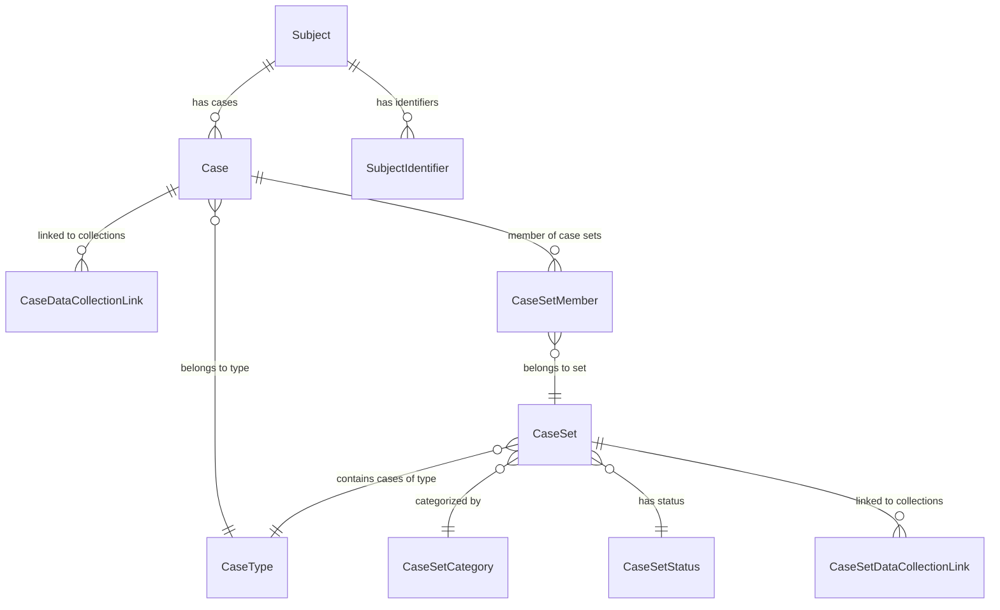
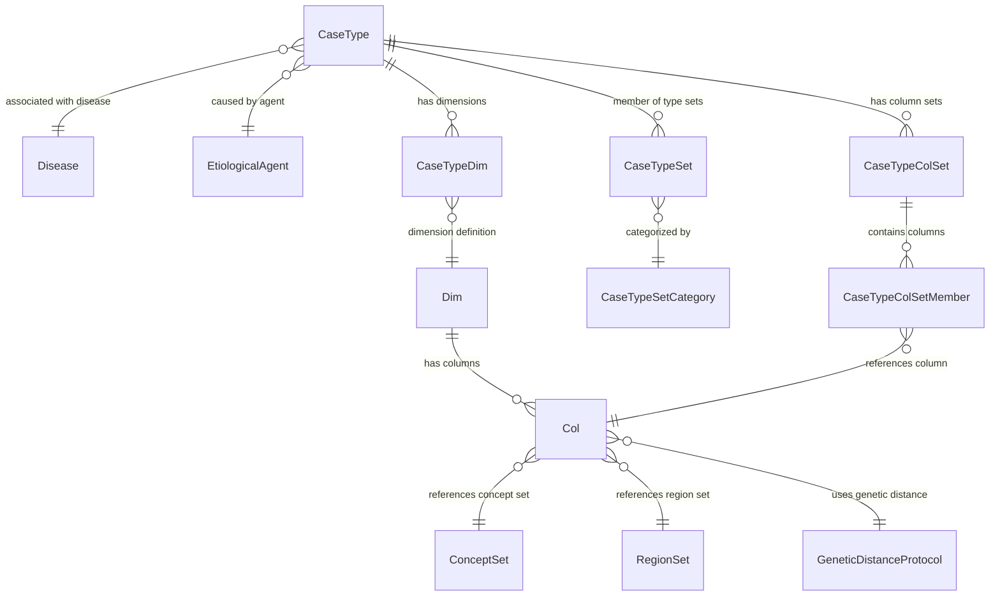
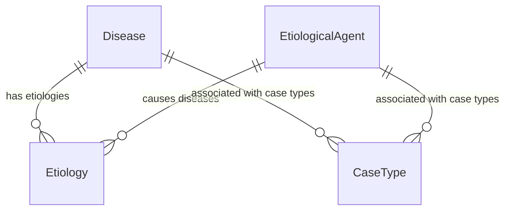
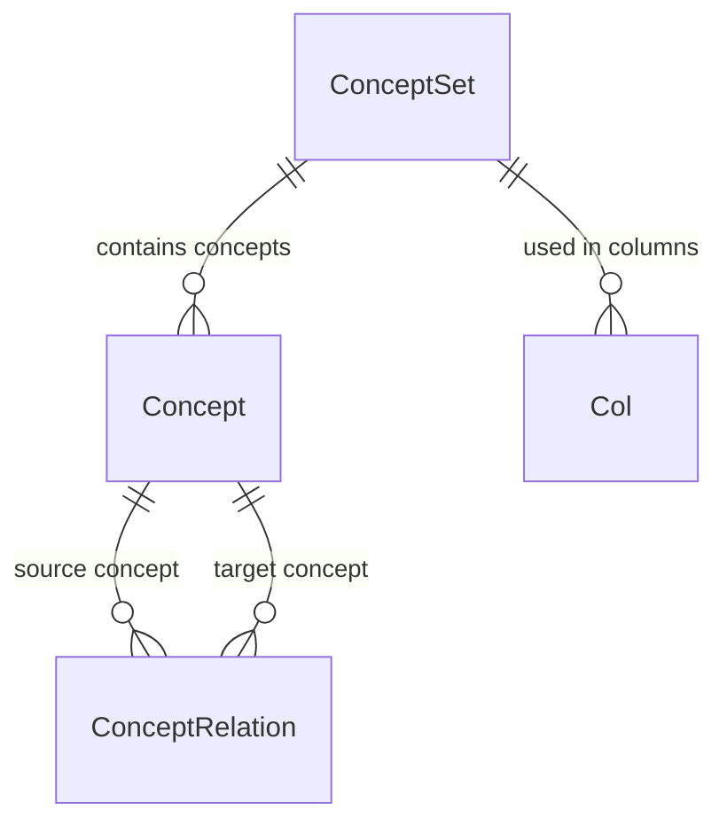
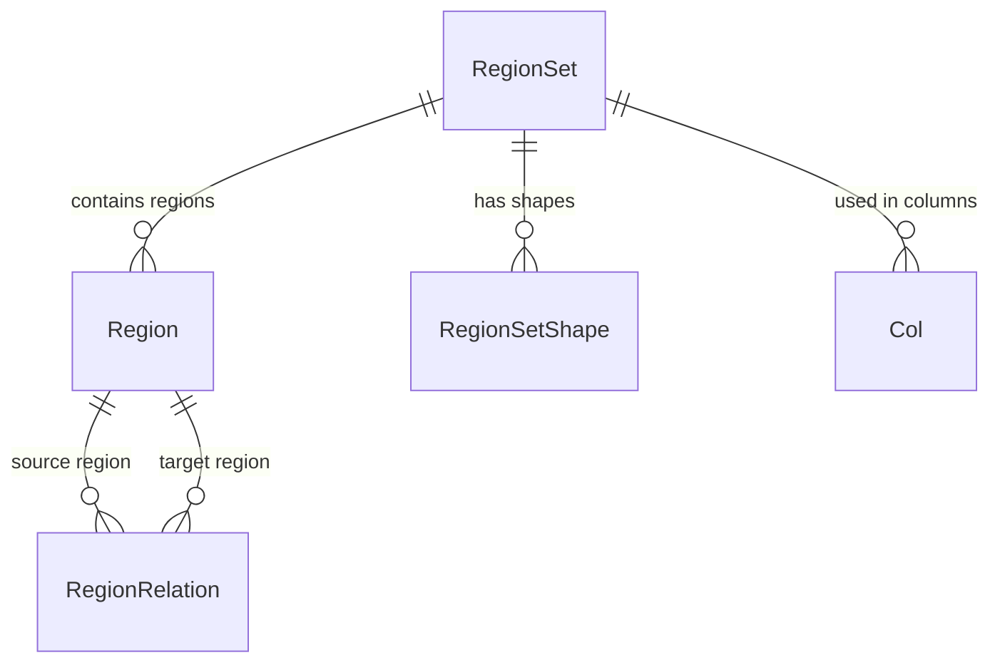
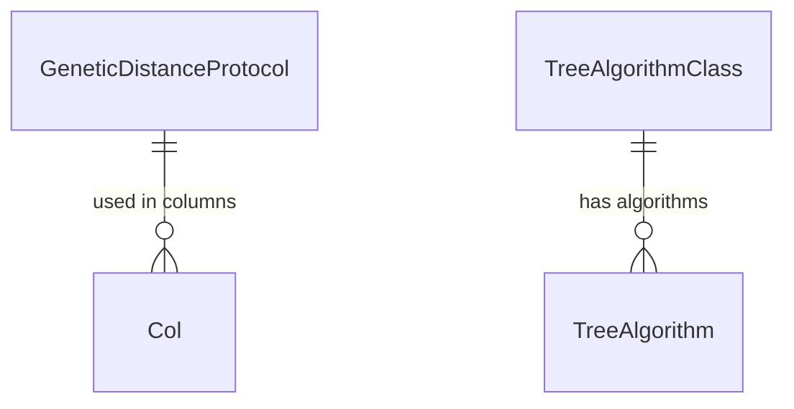
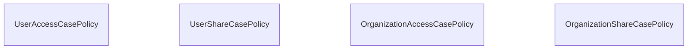

# CaseDB SQLAlchemy Models - Entity Relationship Diagrams

This document contains simplified ERDs showing different functional areas of the CaseDB SQLAlchemy models for epidemiological case management.

## 1. Core Case and Subject Management

## 2. Case Type Definition and Structure

## 3. Disease and Etiology

## 4. Ontology and Concepts

## 5. Geographic Regions

## 6. Genetic Analysis and Phylogenetics

## 7. Access Control Policies

## Key Model Groups

### 📋 **Core Epidemiological Data**
- **Case** - Individual epidemiological cases with flexible content structure
- **Subject** - People or entities associated with cases
- **CaseType** - Templates defining case structure and validation rules

### 👥 **Case Management**
- **CaseSet** - Collections of related cases for analysis
- **CaseSetMember** - Case membership with classification status
- **CaseSetCategory/Status** - Case set organization and workflow

### 🏗️ **Case Structure Definition** 
- **Dim** - Dimensions for organizing case data fields
- **Col** - Columns defining specific data fields in cases
- **CaseTypeDim/CaseTypeColSet** - Linking case types to their structure

### 🦠 **Disease and Causation**
- **Disease** - Disease definitions with ICD codes
- **EtiologicalAgent** - Causative agents (pathogens, toxins, etc.)
- **Etiology** - Disease-agent relationships

### 📚 **Knowledge Management**
- **ConceptSet** - Controlled vocabularies and value sets
- **Concept** - Individual concepts with codes and descriptions
- **ConceptRelation** - Hierarchical and associative relationships

### 🗺️ **Geographic Data**
- **RegionSet** - Geographic hierarchies (countries, states, etc.)
- **Region** - Individual geographic areas with coordinates
- **RegionRelation** - Geographic containment relationships
- **RegionSetShape** - GeoJSON shape data for mapping

### 🧬 **Genetic Analysis**
- **GeneticDistanceProtocol** - Methods for calculating genetic distances
- **TreeAlgorithm/TreeAlgorithmClass** - Phylogenetic tree algorithms

### 🔐 **Security and Access Control**
- **UserAccessCasePolicy** - Individual user access permissions
- **UserShareCasePolicy** - User data sharing permissions  
- **OrganizationAccessCasePolicy** - Organization-level access rules
- **OrganizationShareCasePolicy** - Organization data sharing rules

### 🔗 **Integration Points**
- **SubjectIdentifier** - External system identifiers for subjects
- **CaseDataCollectionLink** - Links cases to data collection events
- **CaseSetDataCollectionLink** - Links case sets to data collections

The CaseDB models support flexible, structured epidemiological case management with rich metadata, geographic integration, and genetic analysis capabilities for comprehensive outbreak investigation and surveillance.