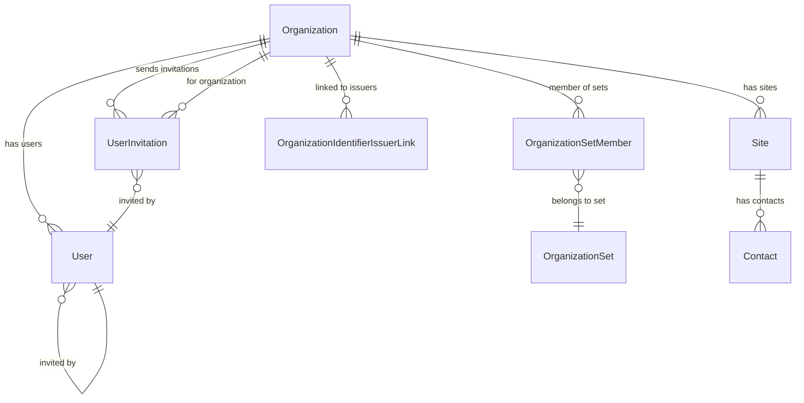
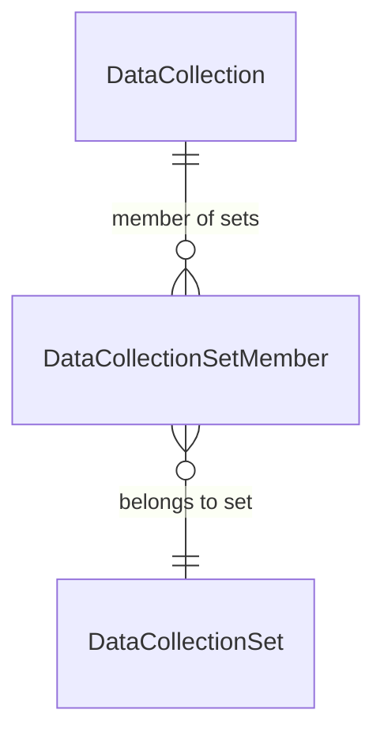
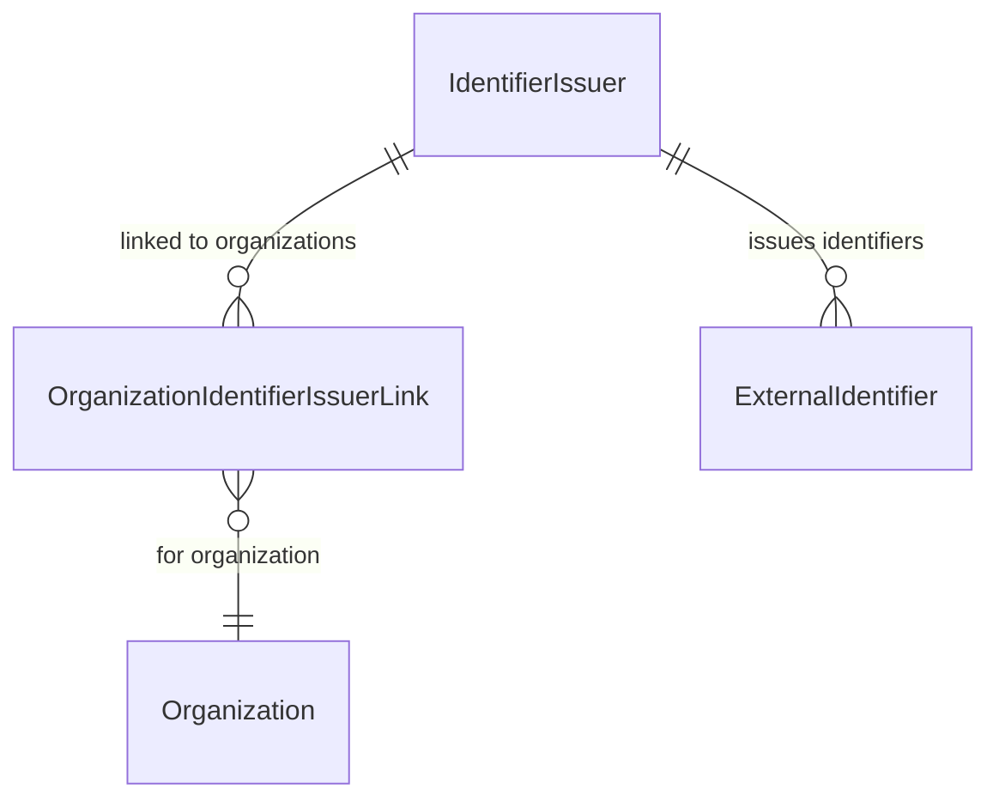
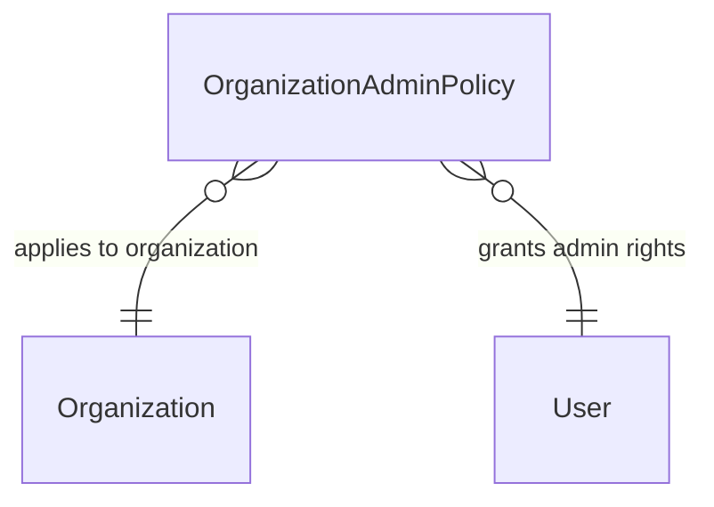
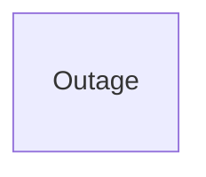
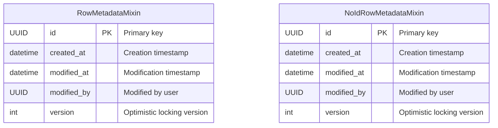

# CommonDB SQLAlchemy Models - Entity Relationship Diagrams

This document contains simplified ERDs showing the shared entities in the CommonDB service that are used across all Gen-EpiX services.

## 1. Organization Management

## 2. Data Collection Management

## 3. Identifier Management

## 4. Access Control (ABAC)

## 5. System Management

## 6. Base Mixins

## Key Model Groups

### 🏢 **Organization Structure**
- **Organization** - Root organizational entities with legal entity codes
- **OrganizationSet** - Collections of related organizations
- **OrganizationSetMember** - Organization membership in sets
- **Site** - Physical locations within organizations  
- **Contact** - Contact information for sites

### 👥 **User Management**
- **User** - System users with roles and permissions
- **UserInvitation** - Pending user invitations with expiration
- **OrganizationAdminPolicy** - ABAC policy for organization admin rights

### 📋 **Data Collection**
- **DataCollection** - Data collection events and projects
- **DataCollectionSet** - Collections of related data collections
- **DataCollectionSetMember** - Membership linking collections to sets

### 🆔 **External Integration**
- **IdentifierIssuer** - External systems that provide identifiers
- **OrganizationIdentifierIssuerLink** - Links organizations to identifier issuers
- **ExternalIdentifier** - Mapping between external and internal identifiers

### ⚠️ **System Operations**
- **Outage** - System maintenance and outage notifications

### 🏗️ **Foundation Mixins**
- **RowMetadataMixin** - Standard audit fields for all entities
- **NoIdRowMetadataMixin** - Audit fields for entities with custom IDs

## Integration Patterns

### 🔄 **Cross-Service Usage**
These CommonDB entities are imported and used by all other services:

**SeqDB Integration:**
- Sample → DataCollection (created_in_data_collection_id)
- SampleDataCollectionLink → DataCollection
- SampleIdentifier → IdentifierIssuer

**CaseDB Integration:**  
- Case → DataCollection (created_in_data_collection_id)
- Subject → DataCollection (data_collection_id)
- CaseDataCollectionLink → DataCollection
- SubjectIdentifier → IdentifierIssuer

**OMOPDB Integration:**
- Person → DataCollection (via DataLineageMixin.provenance_id)
- All clinical events → DataCollection (via provenance tracking)

### 🔐 **ABAC (Attribute-Based Access Control)**
The ABAC system uses:
- **OrganizationAdminPolicy** - Grants users administrative rights over organizations
- **User roles** - Role-based permissions stored in User.roles field
- **Organization hierarchy** - Access control based on organizational membership

### 🏷️ **Mixin Pattern**
CommonDB provides both concrete models and mixins:
- **Mixins** (OrganizationMixin, UserMixin, etc.) - Used by other services
- **Concrete Models** (Organization, User, etc.) - Used directly by CommonDB service

This shared foundation ensures consistent identity management, access control, and data lineage tracking across the entire Gen-EpiX multi-service platform.