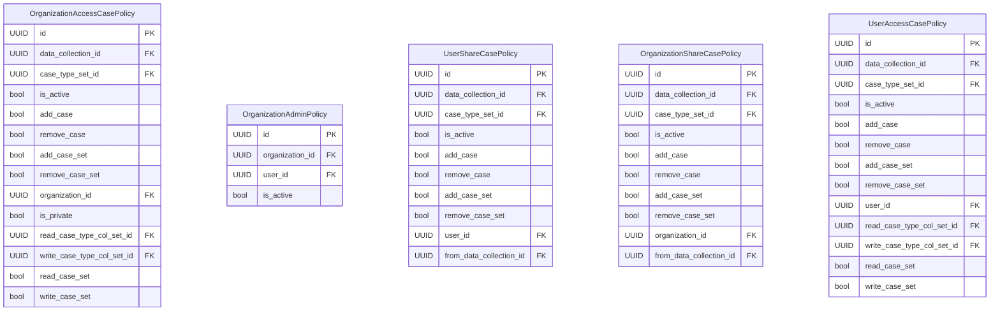

# casedb / ABAC — Detailed ERD

Auto-generated.  Service type **ABAC** — 5 entities.

```mermaid
erDiagram
    %% casedb / ABAC (detailed)

    %% Entity definitions
    OrganizationAccessCasePolicy {
        UUID id PK
        UUID data_collection_id FK
        UUID case_type_set_id FK
        bool is_active
        bool add_case
        bool remove_case
        bool add_case_set
        bool remove_case_set
        UUID organization_id FK
        bool is_private
        UUID read_case_type_col_set_id FK
        UUID write_case_type_col_set_id FK
        bool read_case_set
        bool write_case_set
    }

    OrganizationAdminPolicy {
        UUID id PK
        UUID organization_id FK
        UUID user_id FK
        bool is_active
    }

    UserShareCasePolicy {
        UUID id PK
        UUID data_collection_id FK
        UUID case_type_set_id FK
        bool is_active
        bool add_case
        bool remove_case
        bool add_case_set
        bool remove_case_set
        UUID user_id FK
        UUID from_data_collection_id FK
    }

    OrganizationShareCasePolicy {
        UUID id PK
        UUID data_collection_id FK
        UUID case_type_set_id FK
        bool is_active
        bool add_case
        bool remove_case
        bool add_case_set
        bool remove_case_set
        UUID organization_id FK
        UUID from_data_collection_id FK
    }

    UserAccessCasePolicy {
        UUID id PK
        UUID data_collection_id FK
        UUID case_type_set_id FK
        bool is_active
        bool add_case
        bool remove_case
        bool add_case_set
        bool remove_case_set
        UUID user_id FK
        UUID read_case_type_col_set_id FK
        UUID write_case_type_col_set_id FK
        bool read_case_set
        bool write_case_set
    }

```
