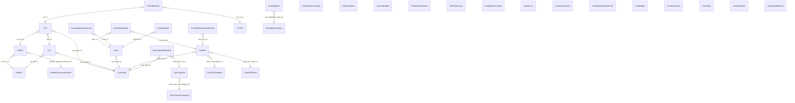

# casedb / CASE — Simplified ERD

Auto-generated.  Service type **CASE** — 35 entities, relationships only.

```mermaid
erDiagram
    %% casedb / CASE (simplified)

    %% Relationships
    CaseSetMember }o--|| CaseSet : "case_set_id"
    CaseSetMember }o--|| Case : "case_id"
    CaseDataCollectionLink }o--|| Case : "case_id"
    RefCol }o--|| RefDim : "ref_dim_id"
    RefCol }o--|| GeneticDistanceProtocol : "genetic_distance_protocol_id"
    CaseIdentifier }o--|| Case : "internal_id"
    Col }o--|| CaseType : "case_type_id"
    Col }o--|| Dim : "dim_id"
    Col }o--|| RefCol : "ref_col_id"
    CaseSetDataCollectionLink }o--|| CaseSet : "case_set_id"
    CaseTypeSet }o--|| CaseTypeSetCategory : "case_type_set_category_id"
    Dim }o--|| CaseType : "case_type_id"
    Dim }o--|| RefDim : "ref_dim_id"
    Case }o--|| CaseType : "case_type_id"
    ColSetMember }o--|| ColSet : "col_set_id"
    ColSetMember }o--|| Col : "col_id"
    CaseSet }o--|| CaseType : "case_type_id"
    CaseSet }o--|| CaseSetCategory : "case_set_category_id"
    CaseSet }o--|| CaseSetStatus : "case_set_status_id"
    TreeAlgorithm }o--|| TreeAlgorithmClass : "tree_algorithm_class_id"
    CaseTypeSetMember }o--|| CaseTypeSet : "case_type_set_id"
    CaseTypeSetMember }o--|| CaseType : "case_type_id"

    CaseBatchForUpload {
    }

    SeqForUpload {
    }

    CaseSetRights {
    }

    ReadSetForUpload {
    }

    RefDataAccess {
    }

    CompleteCaseType {
    }

    CaseQuery {
    }

    CaseQueryResult {
    }

    CaseBatchUploadResult {
    }

    CaseRights {
    }

    CaseForUpload {
    }

    CaseStats {
    }

    CaseSetQuery {
    }

    CaseUploadResult {
    }

```
