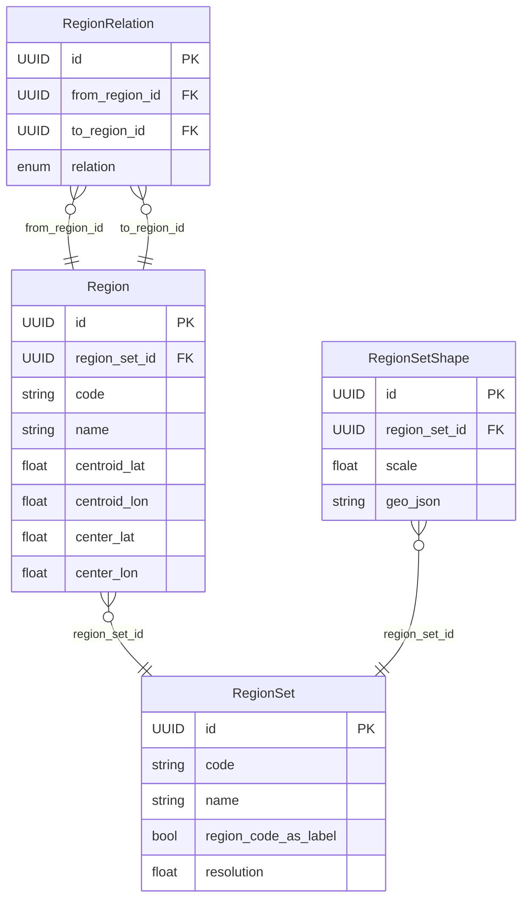

# casedb / GEO — Detailed ERD

Auto-generated.  Service type **GEO** — 4 entities.

```mermaid
erDiagram
    %% casedb / GEO (detailed)

    %% Relationships
    Region }o--|| RegionSet : "region_set_id"
    RegionSetShape }o--|| RegionSet : "region_set_id"
    RegionRelation }o--|| Region : "from_region_id"
    RegionRelation }o--|| Region : "to_region_id"

    %% Entity definitions
    Region {
        UUID id PK
        UUID region_set_id FK
        string code
        string name
        float centroid_lat
        float centroid_lon
        float center_lat
        float center_lon
    }

    RegionSet {
        UUID id PK
        string code
        string name
        bool region_code_as_label
        float resolution
    }

    RegionSetShape {
        UUID id PK
        UUID region_set_id FK
        float scale
        string geo_json
    }

    RegionRelation {
        UUID id PK
        UUID from_region_id FK
        UUID to_region_id FK
        enum relation
    }

```
