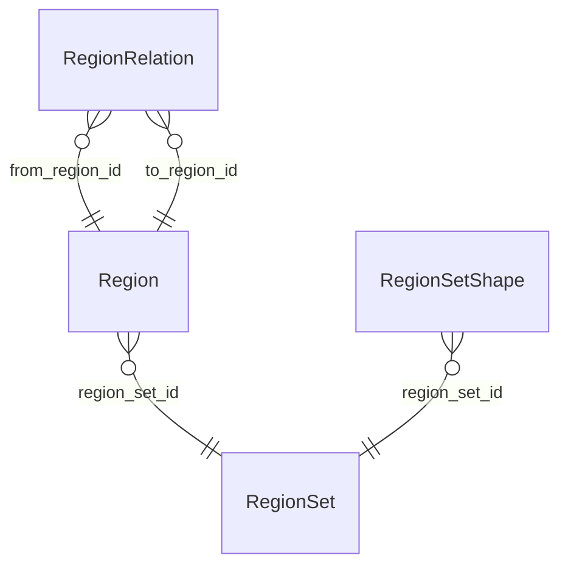

# casedb / GEO — Simplified ERD

Auto-generated.  Service type **GEO** — 4 entities, relationships only.

```mermaid
erDiagram
    %% casedb / GEO (simplified)

    %% Relationships
    Region }o--|| RegionSet : "region_set_id"
    RegionRelation }o--|| Region : "from_region_id"
    RegionRelation }o--|| Region : "to_region_id"
    RegionSetShape }o--|| RegionSet : "region_set_id"

```
