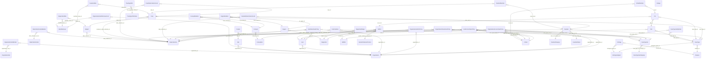

# casedb — Simplified Entity-Relationship Diagram

Auto-generated from domain model definitions.  Contains **51** persistable entities — relationships only, no field details.

```mermaid
erDiagram
    %% casedb — all persistable entities (simplified)

    %% Relationships
    OrganizationSetMember }o--|| OrganizationSet : "organization_set_id"
    OrganizationSetMember }o--|| Organization : "organization_id"
    DataCollectionSetMember }o--|| DataCollectionSet : "data_collection_set_id"
    DataCollectionSetMember }o--|| DataCollection : "data_collection_id"
    OrganizationIdentifierIssuerLink }o--|| Organization : "organization_id"
    OrganizationIdentifierIssuerLink }o--|| IdentifierIssuer : "identifier_issuer_id"
    Site }o--|| Organization : "organization_id"
    Contact }o--|| Site : "site_id"
    User }o--|| Organization : "organization_id"
    UserInvitation }o--|| Organization : "organization_id"
    UserInvitation }o--|| User : "invited_by_user_id"
    Concept }o--|| ConceptSet : "concept_set_id"
    ConceptRelation }o--|| Concept : "from_concept_id"
    ConceptRelation }o--|| Concept : "to_concept_id"
    Etiology }o--|| Disease : "disease_id"
    Etiology }o--|| EtiologicalAgent : "etiological_agent_id"
    Region }o--|| RegionSet : "region_set_id"
    RegionRelation }o--|| Region : "from_region_id"
    RegionRelation }o--|| Region : "to_region_id"
    RegionSetShape }o--|| RegionSet : "region_set_id"
    Subject }o--|| DataCollection : "data_collection_id"
    SubjectIdentifier }o--|| Subject : "subject_id"
    SubjectIdentifier }o--|| IdentifierIssuer : "identifier_issuer_id"
    TreeAlgorithm }o--|| TreeAlgorithmClass : "tree_algorithm_class_id"
    RefCol }o--|| RefDim : "ref_dim_id"
    RefCol }o--|| ConceptSet : "concept_set_id"
    RefCol }o--|| RegionSet : "region_set_id"
    RefCol }o--|| GeneticDistanceProtocol : "genetic_distance_protocol_id"
    CaseType }o--|| Disease : "disease_id"
    CaseType }o--|| EtiologicalAgent : "etiological_agent_id"
    CaseTypeSet }o--|| CaseTypeSetCategory : "case_type_set_category_id"
    CaseTypeSetMember }o--|| CaseTypeSet : "case_type_set_id"
    CaseTypeSetMember }o--|| CaseType : "case_type_id"
    Dim }o--|| CaseType : "case_type_id"
    Dim }o--|| RefDim : "ref_dim_id"
    Col }o--|| CaseType : "case_type_id"
    Col }o--|| Dim : "dim_id"
    Col }o--|| RefCol : "ref_col_id"
    ColSetMember }o--|| ColSet : "col_set_id"
    ColSetMember }o--|| Col : "col_id"
    Case }o--|| CaseType : "case_type_id"
    Case }o--|| Subject : "subject_id"
    Case }o--|| DataCollection : "created_in_data_collection_id"
    CaseIdentifier }o--|| IdentifierIssuer : "identifier_issuer_id"
    CaseIdentifier }o--|| Case : "internal_id"
    CaseSet }o--|| CaseType : "case_type_id"
    CaseSet }o--|| DataCollection : "created_in_data_collection_id"
    CaseSet }o--|| CaseSetCategory : "case_set_category_id"
    CaseSet }o--|| CaseSetStatus : "case_set_status_id"
    CaseSetMember }o--|| CaseSet : "case_set_id"
    CaseSetMember }o--|| Case : "case_id"
    CaseDataCollectionLink }o--|| Case : "case_id"
    CaseDataCollectionLink }o--|| DataCollection : "data_collection_id"
    CaseSetDataCollectionLink }o--|| CaseSet : "case_set_id"
    CaseSetDataCollectionLink }o--|| DataCollection : "data_collection_id"
    OrganizationAdminPolicy }o--|| Organization : "organization_id"
    OrganizationAdminPolicy }o--|| User : "user_id"
    OrganizationAccessCasePolicy }o--|| Organization : "organization_id"
    OrganizationAccessCasePolicy }o--|| DataCollection : "data_collection_id"
    OrganizationAccessCasePolicy }o--|| CaseTypeSet : "case_type_set_id"
    OrganizationAccessCasePolicy }o--|| ColSet : "read_col_set_id"
    OrganizationAccessCasePolicy }o--|| ColSet : "write_col_set_id"
    OrganizationShareCasePolicy }o--|| Organization : "organization_id"
    OrganizationShareCasePolicy }o--|| DataCollection : "data_collection_id"
    OrganizationShareCasePolicy }o--|| CaseTypeSet : "case_type_set_id"
    OrganizationShareCasePolicy }o--|| DataCollection : "from_data_collection_id"
    UserAccessCasePolicy }o--|| User : "user_id"
    UserAccessCasePolicy }o--|| DataCollection : "data_collection_id"
    UserAccessCasePolicy }o--|| CaseTypeSet : "case_type_set_id"
    UserAccessCasePolicy }o--|| ColSet : "read_col_set_id"
    UserAccessCasePolicy }o--|| ColSet : "write_col_set_id"
    UserShareCasePolicy }o--|| User : "user_id"
    UserShareCasePolicy }o--|| DataCollection : "data_collection_id"
    UserShareCasePolicy }o--|| CaseTypeSet : "case_type_set_id"
    UserShareCasePolicy }o--|| DataCollection : "from_data_collection_id"

    Outage {
    }

```
