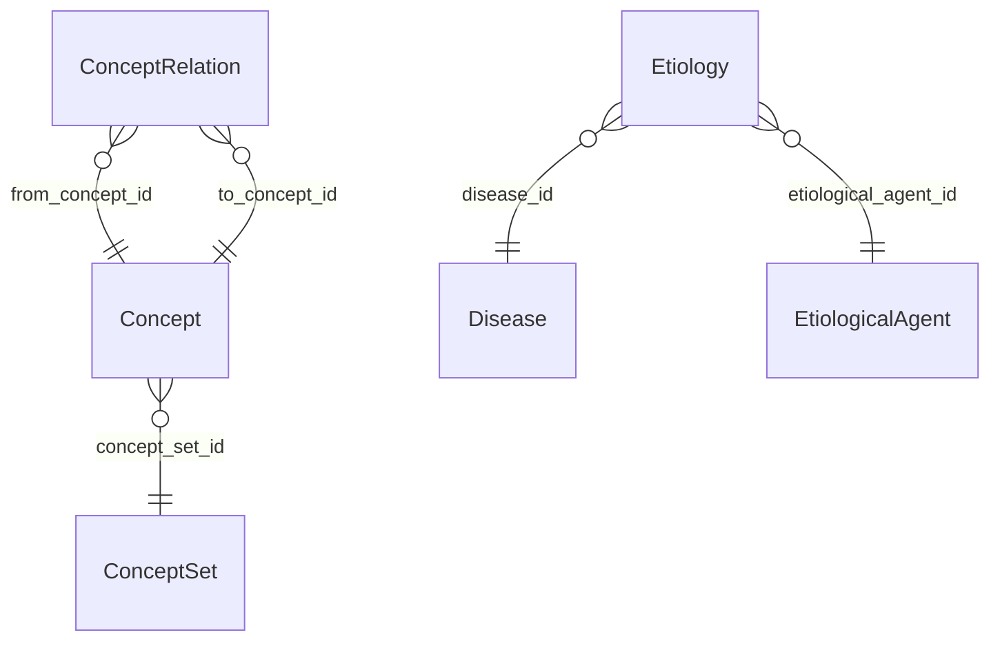

# casedb / ONTOLOGY — Simplified ERD

Auto-generated.  Service type **ONTOLOGY** — 6 entities, relationships only.

```mermaid
erDiagram
    %% casedb / ONTOLOGY (simplified)

    %% Relationships
    ConceptRelation }o--|| Concept : "from_concept_id"
    ConceptRelation }o--|| Concept : "to_concept_id"
    Concept }o--|| ConceptSet : "concept_set_id"
    Etiology }o--|| Disease : "disease_id"
    Etiology }o--|| EtiologicalAgent : "etiological_agent_id"

```
