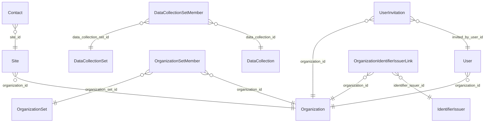

# casedb / ORGANIZATION — Simplified ERD

Auto-generated.  Service type **ORGANIZATION** — 12 entities, relationships only.

```mermaid
erDiagram
    %% casedb / ORGANIZATION (simplified)

    %% Relationships
    Site }o--|| Organization : "organization_id"
    User }o--|| Organization : "organization_id"
    OrganizationSetMember }o--|| OrganizationSet : "organization_set_id"
    OrganizationSetMember }o--|| Organization : "organization_id"
    DataCollectionSetMember }o--|| DataCollectionSet : "data_collection_set_id"
    DataCollectionSetMember }o--|| DataCollection : "data_collection_id"
    OrganizationIdentifierIssuerLink }o--|| Organization : "organization_id"
    OrganizationIdentifierIssuerLink }o--|| IdentifierIssuer : "identifier_issuer_id"
    Contact }o--|| Site : "site_id"
    UserInvitation }o--|| Organization : "organization_id"
    UserInvitation }o--|| User : "invited_by_user_id"

```
