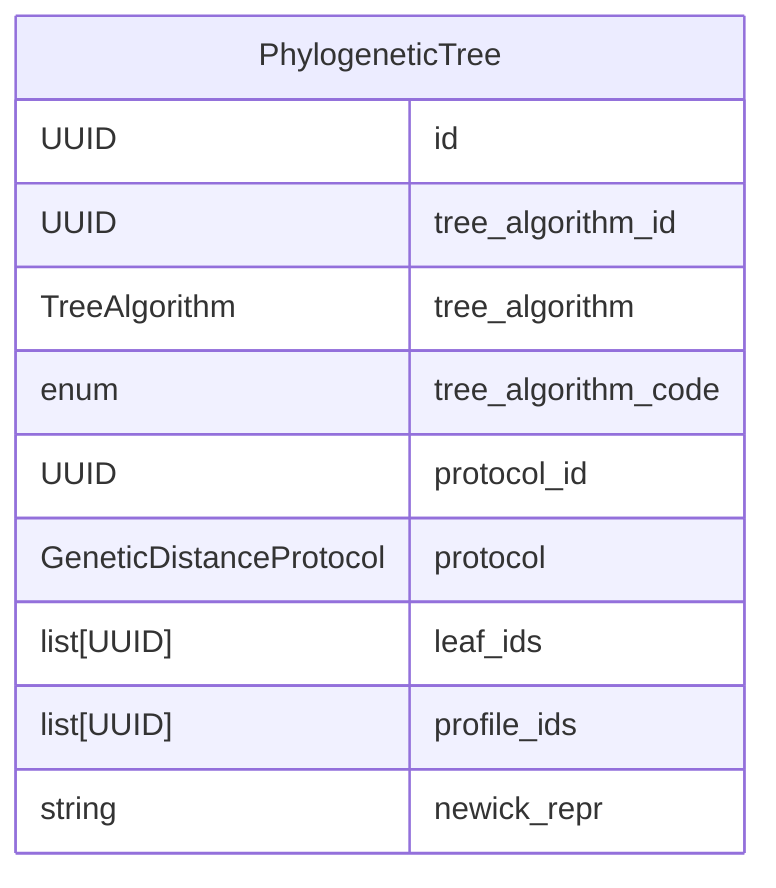

# casedb / SEQDB — Detailed ERD

Auto-generated.  Service type **SEQDB** — 1 entities.

```mermaid
erDiagram
    %% casedb / SEQDB (detailed)

    %% Entity definitions
    PhylogeneticTree {
        UUID id
        UUID tree_algorithm_id
        TreeAlgorithm tree_algorithm
        enum tree_algorithm_code
        UUID protocol_id
        GeneticDistanceProtocol protocol
        list[UUID] leaf_ids
        list[UUID] profile_ids
        string newick_repr
    }

```
