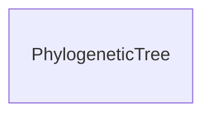

# casedb / SEQDB — Simplified ERD

Auto-generated.  Service type **SEQDB** — 1 entities, relationships only.

```mermaid
erDiagram
    %% casedb / SEQDB (simplified)

    PhylogeneticTree {
    }

```
