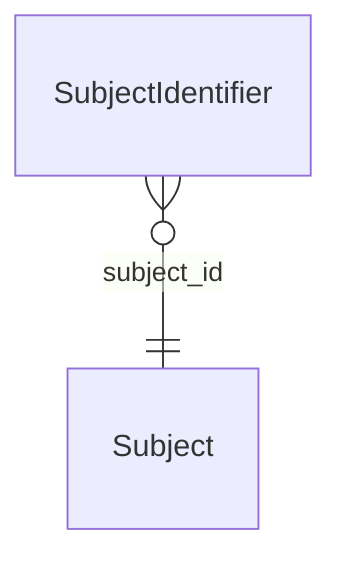

# casedb / SUBJECT — Simplified ERD

Auto-generated.  Service type **SUBJECT** — 2 entities, relationships only.

```mermaid
erDiagram
    %% casedb / SUBJECT (simplified)

    %% Relationships
    SubjectIdentifier }o--|| Subject : "subject_id"

```
