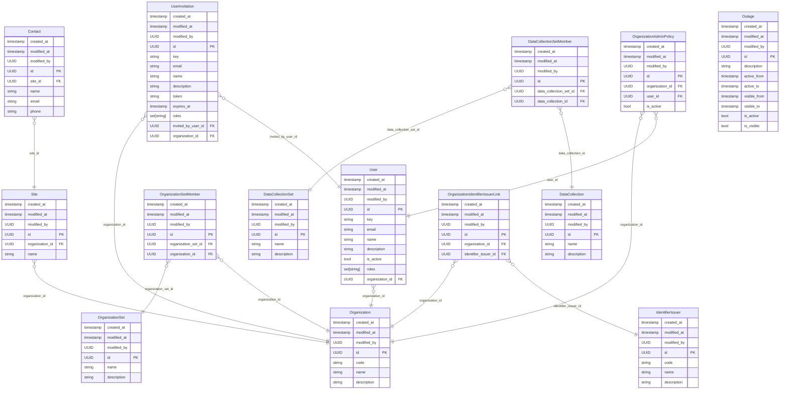

# commondb — Detailed Entity-Relationship Diagram

Auto-generated from domain model definitions.  Contains **14** persistable entities with their field definitions.

```mermaid
erDiagram
    %% commondb — all persistable entities (detailed)

    %% Relationships
    Site }o--|| Organization : "organization_id"
    User }o--|| Organization : "organization_id"
    OrganizationSetMember }o--|| OrganizationSet : "organization_set_id"
    OrganizationSetMember }o--|| Organization : "organization_id"
    DataCollectionSetMember }o--|| DataCollectionSet : "data_collection_set_id"
    DataCollectionSetMember }o--|| DataCollection : "data_collection_id"
    OrganizationIdentifierIssuerLink }o--|| Organization : "organization_id"
    OrganizationIdentifierIssuerLink }o--|| IdentifierIssuer : "identifier_issuer_id"
    Contact }o--|| Site : "site_id"
    UserInvitation }o--|| Organization : "organization_id"
    UserInvitation }o--|| User : "invited_by_user_id"
    OrganizationAdminPolicy }o--|| Organization : "organization_id"
    OrganizationAdminPolicy }o--|| User : "user_id"

    %% Entity definitions
    Outage {
        timestamp created_at
        timestamp modified_at
        UUID modified_by
        UUID id PK
        string description
        timestamp active_from
        timestamp active_to
        timestamp visible_from
        timestamp visible_to
        bool is_active
        bool is_visible
    }

    Organization {
        timestamp created_at
        timestamp modified_at
        UUID modified_by
        UUID id PK
        string code
        string name
        string description
    }

    OrganizationSet {
        timestamp created_at
        timestamp modified_at
        UUID modified_by
        UUID id PK
        string name
        string description
    }

    DataCollection {
        timestamp created_at
        timestamp modified_at
        UUID modified_by
        UUID id PK
        string name
        string description
    }

    DataCollectionSet {
        timestamp created_at
        timestamp modified_at
        UUID modified_by
        UUID id PK
        string name
        string description
    }

    IdentifierIssuer {
        timestamp created_at
        timestamp modified_at
        UUID modified_by
        UUID id PK
        string code
        string name
        string description
    }

    Site {
        timestamp created_at
        timestamp modified_at
        UUID modified_by
        UUID id PK
        UUID organization_id FK
        string name
    }

    User {
        timestamp created_at
        timestamp modified_at
        UUID modified_by
        UUID id PK
        string key
        string email
        string name
        string description
        bool is_active
        set[string] roles
        UUID organization_id FK
    }

    OrganizationSetMember {
        timestamp created_at
        timestamp modified_at
        UUID modified_by
        UUID id PK
        UUID organization_set_id FK
        UUID organization_id FK
    }

    DataCollectionSetMember {
        timestamp created_at
        timestamp modified_at
        UUID modified_by
        UUID id PK
        UUID data_collection_set_id FK
        UUID data_collection_id FK
    }

    OrganizationIdentifierIssuerLink {
        timestamp created_at
        timestamp modified_at
        UUID modified_by
        UUID id PK
        UUID organization_id FK
        UUID identifier_issuer_id FK
    }

    Contact {
        timestamp created_at
        timestamp modified_at
        UUID modified_by
        UUID id PK
        UUID site_id FK
        string name
        string email
        string phone
    }

    UserInvitation {
        timestamp created_at
        timestamp modified_at
        UUID modified_by
        UUID id PK
        string key
        string email
        string name
        string description
        string token
        timestamp expires_at
        set[string] roles
        UUID invited_by_user_id FK
        UUID organization_id FK
    }

    OrganizationAdminPolicy {
        timestamp created_at
        timestamp modified_at
        UUID modified_by
        UUID id PK
        UUID organization_id FK
        UUID user_id FK
        bool is_active
    }

```
