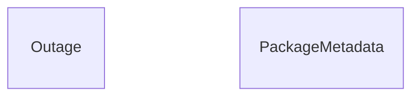

# commondb / SYSTEM — Simplified ERD

Auto-generated.  Service type **SYSTEM** — 2 entities, relationships only.

```mermaid
erDiagram
    %% commondb / SYSTEM (simplified)

    Outage {
    }

    PackageMetadata {
    }

```
