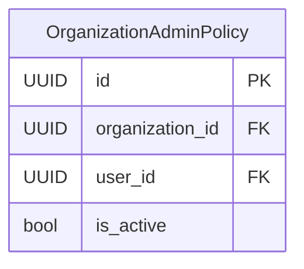

# omopdb / ABAC — Detailed ERD

Auto-generated.  Service type **ABAC** — 1 entities.

```mermaid
erDiagram
    %% omopdb / ABAC (detailed)

    %% Entity definitions
    OrganizationAdminPolicy {
        UUID id PK
        UUID organization_id FK
        UUID user_id FK
        bool is_active
    }

```
