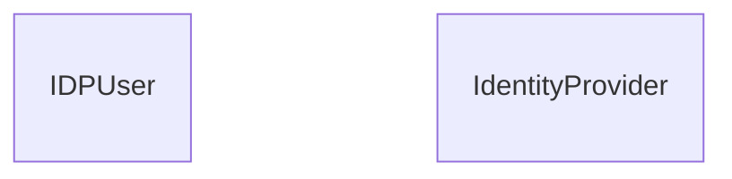

# omopdb / AUTH — Simplified ERD

Auto-generated.  Service type **AUTH** — 2 entities, relationships only.

```mermaid
erDiagram
    %% omopdb / AUTH (simplified)

    IDPUser {
    }

    IdentityProvider {
    }

```
