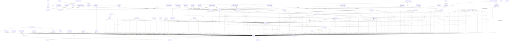

# omopdb — Simplified Entity-Relationship Diagram

Auto-generated from domain model definitions.  Contains **69** persistable entities — relationships only, no field details.

```mermaid
erDiagram
    %% omopdb — all persistable entities (simplified)

    %% Relationships
    Site }o--|| Organization : "organization_id"
    User }o--|| Organization : "organization_id"
    OrganizationSetMember }o--|| OrganizationSet : "organization_set_id"
    OrganizationSetMember }o--|| Organization : "organization_id"
    DataCollectionSetMember }o--|| DataCollectionSet : "data_collection_set_id"
    DataCollectionSetMember }o--|| DataCollection : "data_collection_id"
    OrganizationIdentifierIssuerLink }o--|| Organization : "organization_id"
    OrganizationIdentifierIssuerLink }o--|| IdentifierIssuer : "identifier_issuer_id"
    Concept }o--|| Domain : "domain_id"
    Concept }o--|| Vocabulary : "vocabulary_id"
    Concept }o--|| ConceptClass : "concept_class_id"
    Cohort }o--|| CohortDefinition : "cohort_definition_id"
    Contact }o--|| Site : "site_id"
    UserInvitation }o--|| Organization : "organization_id"
    UserInvitation }o--|| User : "invited_by_user_id"
    OrganizationAdminPolicy }o--|| Organization : "organization_id"
    OrganizationAdminPolicy }o--|| User : "user_id"
    Relationship }o--|| Concept : "relationship_concept_id"
    ConceptAncestor }o--|| Concept : "ancestor_concept_id"
    ConceptAncestor }o--|| Concept : "descendant_concept_id"
    ConceptSynonym }o--|| Concept : "concept_id"
    ConceptSynonym }o--|| Concept : "language_concept_id"
    SourceToConceptMap }o--|| Concept : "source_concept_id"
    SourceToConceptMap }o--|| Concept : "target_concept_id"
    SourceToConceptMap }o--|| Vocabulary : "target_vocabulary_id"
    DrugStrength }o--|| Concept : "drug_concept_id"
    DrugStrength }o--|| Concept : "ingredient_concept_id"
    DrugStrength }o--|| Concept : "amount_unit_concept_id"
    DrugStrength }o--|| Concept : "numerator_unit_concept_id"
    DrugStrength }o--|| Concept : "denominator_unit_concept_id"
    CareSite }o--|| Concept : "place_of_service_concept_id"
    CareSite }o--|| Location : "location_id"
    Metadata }o--|| Concept : "metadata_concept_id"
    Metadata }o--|| Concept : "metadata_type_concept_id"
    Metadata }o--|| Concept : "value_as_concept_id"
    NoteNlp }o--|| Concept : "section_concept_id"
    NoteNlp }o--|| Concept : "note_nlp_concept_id"
    NoteNlp }o--|| Concept : "note_nlp_source_concept_id"
    FactRelationship }o--|| Concept : "domain_concept_id_1"
    FactRelationship }o--|| Concept : "domain_concept_id_2"
    FactRelationship }o--|| Concept : "relationship_concept_id"
    Cost }o--|| Domain : "cost_domain_id"
    Cost }o--|| Concept : "cost_type_concept_id"
    Cost }o--|| Concept : "currency_concept_id"
    Cost }o--|| Concept : "revenue_code_concept_id"
    Cost }o--|| Concept : "drg_concept_id"
    ConceptRelationship }o--|| Concept : "concept_id_1"
    ConceptRelationship }o--|| Concept : "concept_id_2"
    ConceptRelationship }o--|| Relationship : "relationship_id"
    Provider }o--|| Concept : "specialty_concept_id"
    Provider }o--|| CareSite : "care_site_id"
    Provider }o--|| Concept : "gender_concept_id"
    Provider }o--|| Concept : "specialty_source_concept_id"
    Provider }o--|| Concept : "gender_source_concept_id"
    NoteNlpIdentifier }o--|| IdentifierIssuer : "identifier_issuer_id"
    NoteNlpIdentifier }o--|| NoteNlp : "internal_id"
    Person }o--|| Concept : "gender_concept_id"
    Person }o--|| Concept : "race_concept_id"
    Person }o--|| Concept : "ethnicity_concept_id"
    Person }o--|| Location : "location_id"
    Person }o--|| Provider : "provider_id"
    Person }o--|| CareSite : "care_site_id"
    Person }o--|| Concept : "gender_source_concept_id"
    Person }o--|| Concept : "race_source_concept_id"
    Person }o--|| Concept : "ethnicity_source_concept_id"
    Person }o--|| Concept : "person_type_concept_id"
    PersonIdentifier }o--|| IdentifierIssuer : "identifier_issuer_id"
    PersonIdentifier }o--|| Person : "internal_id"
    ObservationPeriod }o--|| Person : "person_id"
    ObservationPeriod }o--|| Concept : "period_type_concept_id"
    VisitOccurrence }o--|| Person : "person_id"
    VisitOccurrence }o--|| Concept : "visit_concept_id"
    VisitOccurrence }o--|| Concept : "visit_type_concept_id"
    VisitOccurrence }o--|| Provider : "provider_id"
    VisitOccurrence }o--|| CareSite : "care_site_id"
    VisitOccurrence }o--|| Concept : "visit_source_concept_id"
    VisitOccurrence }o--|| Concept : "admitted_from_concept_id"
    VisitOccurrence }o--|| Concept : "discharged_to_concept_id"
    Specimen }o--|| Person : "person_id"
    Specimen }o--|| Concept : "specimen_concept_id"
    Specimen }o--|| Concept : "specimen_type_concept_id"
    Specimen }o--|| Concept : "unit_concept_id"
    Specimen }o--|| Concept : "anatomic_site_concept_id"
    Specimen }o--|| Concept : "disease_status_concept_id"
    Specimen }o--|| Concept : "derived_from_specimen_concept_id"
    Death }o--|| Person : "person_id"
    Death }o--|| Concept : "death_type_concept_id"
    Death }o--|| Concept : "cause_concept_id"
    Death }o--|| Concept : "cause_source_concept_id"
    PayerPlanPeriod }o--|| Person : "person_id"
    PayerPlanPeriod }o--|| Concept : "payer_concept_id"
    PayerPlanPeriod }o--|| Concept : "payer_source_concept_id"
    PayerPlanPeriod }o--|| Concept : "plan_concept_id"
    PayerPlanPeriod }o--|| Concept : "plan_source_concept_id"
    PayerPlanPeriod }o--|| Concept : "sponsor_concept_id"
    PayerPlanPeriod }o--|| Concept : "sponsor_source_concept_id"
    PayerPlanPeriod }o--|| Concept : "stop_reason_concept_id"
    PayerPlanPeriod }o--|| Concept : "stop_reason_source_concept_id"
    ConditionEra }o--|| Person : "person_id"
    ConditionEra }o--|| Concept : "condition_concept_id"
    DrugEra }o--|| Person : "person_id"
    DrugEra }o--|| Concept : "drug_concept_id"
    DoseEra }o--|| Person : "person_id"
    DoseEra }o--|| Concept : "drug_concept_id"
    DoseEra }o--|| Concept : "unit_concept_id"
    Episode }o--|| Person : "person_id"
    Episode }o--|| Concept : "episode_concept_id"
    Episode }o--|| Concept : "episode_object_concept_id"
    Episode }o--|| Concept : "episode_type_concept_id"
    Episode }o--|| Concept : "episode_source_concept_id"
    ObservationPeriodIdentifier }o--|| IdentifierIssuer : "identifier_issuer_id"
    ObservationPeriodIdentifier }o--|| ObservationPeriod : "internal_id"
    VisitOccurrenceIdentifier }o--|| IdentifierIssuer : "identifier_issuer_id"
    VisitOccurrenceIdentifier }o--|| VisitOccurrence : "internal_id"
    VisitDetail }o--|| Person : "person_id"
    VisitDetail }o--|| Concept : "visit_detail_concept_id"
    VisitDetail }o--|| Concept : "visit_detail_type_concept_id"
    VisitDetail }o--|| Provider : "provider_id"
    VisitDetail }o--|| CareSite : "care_site_id"
    VisitDetail }o--|| Concept : "visit_detail_source_concept_id"
    VisitDetail }o--|| Concept : "admitted_from_concept_id"
    VisitDetail }o--|| Concept : "discharged_to_concept_id"
    VisitDetail }o--|| VisitOccurrence : "visit_occurrence_id"
    SpecimenIdentifier }o--|| IdentifierIssuer : "identifier_issuer_id"
    SpecimenIdentifier }o--|| Specimen : "internal_id"
    DeathIdentifier }o--|| IdentifierIssuer : "identifier_issuer_id"
    DeathIdentifier }o--|| Death : "internal_id"
    EpisodeEvent }o--|| Episode : "episode_id"
    EpisodeEvent }o--|| Concept : "episode_event_field_concept_id"
    VisitDetailIdentifier }o--|| IdentifierIssuer : "identifier_issuer_id"
    VisitDetailIdentifier }o--|| VisitDetail : "internal_id"
    ConditionOccurrence }o--|| Person : "person_id"
    ConditionOccurrence }o--|| Concept : "condition_concept_id"
    ConditionOccurrence }o--|| Concept : "condition_type_concept_id"
    ConditionOccurrence }o--|| Concept : "condition_status_concept_id"
    ConditionOccurrence }o--|| Provider : "provider_id"
    ConditionOccurrence }o--|| VisitOccurrence : "visit_occurrence_id"
    ConditionOccurrence }o--|| VisitDetail : "visit_detail_id"
    ConditionOccurrence }o--|| Concept : "condition_source_concept_id"
    ProcedureOccurrence }o--|| Person : "person_id"
    ProcedureOccurrence }o--|| Concept : "procedure_concept_id"
    ProcedureOccurrence }o--|| Concept : "procedure_type_concept_id"
    ProcedureOccurrence }o--|| Concept : "modifier_concept_id"
    ProcedureOccurrence }o--|| Provider : "provider_id"
    ProcedureOccurrence }o--|| VisitOccurrence : "visit_occurrence_id"
    ProcedureOccurrence }o--|| VisitDetail : "visit_detail_id"
    ProcedureOccurrence }o--|| Concept : "procedure_source_concept_id"
    DrugExposure }o--|| Person : "person_id"
    DrugExposure }o--|| Concept : "drug_concept_id"
    DrugExposure }o--|| Concept : "drug_type_concept_id"
    DrugExposure }o--|| Concept : "route_concept_id"
    DrugExposure }o--|| Provider : "provider_id"
    DrugExposure }o--|| VisitOccurrence : "visit_occurrence_id"
    DrugExposure }o--|| VisitDetail : "visit_detail_id"
    DrugExposure }o--|| Concept : "drug_source_concept_id"
    DeviceExposure }o--|| Person : "person_id"
    DeviceExposure }o--|| Concept : "device_concept_id"
    DeviceExposure }o--|| Concept : "device_type_concept_id"
    DeviceExposure }o--|| Provider : "provider_id"
    DeviceExposure }o--|| VisitOccurrence : "visit_occurrence_id"
    DeviceExposure }o--|| VisitDetail : "visit_detail_id"
    DeviceExposure }o--|| Concept : "device_source_concept_id"
    DeviceExposure }o--|| Concept : "unit_concept_id"
    DeviceExposure }o--|| Concept : "unit_source_concept_id"
    Measurement }o--|| Person : "person_id"
    Measurement }o--|| Concept : "measurement_concept_id"
    Measurement }o--|| Concept : "measurement_type_concept_id"
    Measurement }o--|| Concept : "operator_concept_id"
    Measurement }o--|| Concept : "value_as_concept_id"
    Measurement }o--|| Concept : "unit_concept_id"
    Measurement }o--|| Provider : "provider_id"
    Measurement }o--|| VisitOccurrence : "visit_occurrence_id"
    Measurement }o--|| VisitDetail : "visit_detail_id"
    Measurement }o--|| Concept : "measurement_source_concept_id"
    Measurement }o--|| Concept : "unit_source_concept_id"
    Measurement }o--|| Concept : "meas_event_field_concept_id"
    Measurement }o--|| Specimen : "derived_from_specimen_id"
    Observation }o--|| Person : "person_id"
    Observation }o--|| Concept : "observation_concept_id"
    Observation }o--|| Concept : "observation_type_concept_id"
    Observation }o--|| Concept : "value_as_concept_id"
    Observation }o--|| Concept : "qualifier_concept_id"
    Observation }o--|| Concept : "unit_concept_id"
    Observation }o--|| Provider : "provider_id"
    Observation }o--|| VisitOccurrence : "visit_occurrence_id"
    Observation }o--|| VisitDetail : "visit_detail_id"
    Observation }o--|| Concept : "observation_source_concept_id"
    Observation }o--|| Concept : "obs_event_field_concept_id"
    Note }o--|| Person : "person_id"
    Note }o--|| Concept : "note_type_concept_id"
    Note }o--|| Concept : "note_class_concept_id"
    Note }o--|| Concept : "encoding_concept_id"
    Note }o--|| Concept : "language_concept_id"
    Note }o--|| Provider : "provider_id"
    Note }o--|| VisitOccurrence : "visit_occurrence_id"
    Note }o--|| VisitDetail : "visit_detail_id"
    Note }o--|| Concept : "note_event_field_concept_id"
    ConditionOccurrenceIdentifier }o--|| IdentifierIssuer : "identifier_issuer_id"
    ConditionOccurrenceIdentifier }o--|| ConditionOccurrence : "internal_id"
    ProcedureOccurrenceIdentifier }o--|| IdentifierIssuer : "identifier_issuer_id"
    ProcedureOccurrenceIdentifier }o--|| ProcedureOccurrence : "internal_id"
    DrugExposureIdentifier }o--|| IdentifierIssuer : "identifier_issuer_id"
    DrugExposureIdentifier }o--|| DrugExposure : "internal_id"
    DeviceExposureIdentifier }o--|| IdentifierIssuer : "identifier_issuer_id"
    DeviceExposureIdentifier }o--|| DeviceExposure : "internal_id"
    MeasurementIdentifier }o--|| IdentifierIssuer : "identifier_issuer_id"
    MeasurementIdentifier }o--|| Measurement : "internal_id"
    MeasurementRelation }o--|| Person : "person_id"
    MeasurementRelation }o--|| Measurement : "from_measurement_id"
    MeasurementRelation }o--|| Measurement : "to_measurement_id"
    MeasurementRelation }o--|| Concept : "measurement_relation_concept_id"
    ObservationIdentifier }o--|| IdentifierIssuer : "identifier_issuer_id"
    ObservationIdentifier }o--|| Observation : "internal_id"
    NoteIdentifier }o--|| IdentifierIssuer : "identifier_issuer_id"
    NoteIdentifier }o--|| Note : "internal_id"
    MeasurementRelationIdentifier }o--|| IdentifierIssuer : "identifier_issuer_id"
    MeasurementRelationIdentifier }o--|| MeasurementRelation : "internal_id"

    Outage {
    }

    CdmSource {
    }

```
