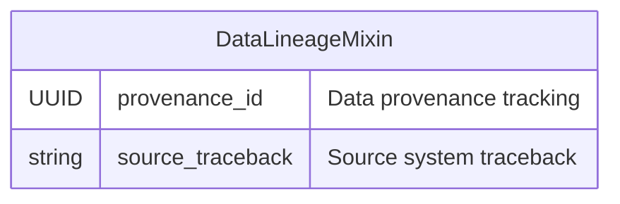

# OMOPDB Base Mixin - Entity Relationship Diagram

This ERD shows the SQLAlchemy mixin class defined in `gen_epix/omopdb/repositories/sa_model/base.py`.

## DataLineageMixin Usage Overview

The **DataLineageMixin** is used by OMOP clinical data models to track data lineage and provenance:

### 🔍 **DataLineageMixin**
Used by clinical data models that require data lineage tracking:
- **Person** - Patient demographic data lineage
- **ObservationPeriod** - Observation period data source
- **VisitOccurrence** - Healthcare visit data tracking  
- **VisitDetail** - Visit detail data provenance
- **ConditionOccurrence** - Condition diagnosis data source
- **ProcedureOccurrence** - Procedure data lineage
- **DrugExposure** - Drug prescription data tracking
- **Measurement** - Laboratory/measurement data source
- **Observation** - Clinical observation data provenance
- **ConditionEra, DrugEra, DoseEra** - Era computation lineage

### 📊 **Fields**
- **provenance_id**: Links to the data collection or ETL process that created the record
- **source_traceback**: String field for tracking the original source system or file

### 🎯 **Purpose**
Essential for healthcare data governance and quality assurance:
- **Data Quality**: Track where clinical data originated
- **Audit Trail**: Maintain chain of custody for regulatory compliance  
- **ETL Monitoring**: Monitor data transformation processes
- **Error Investigation**: Trace data issues back to source systems

This mixin enables comprehensive data lineage tracking throughout the OMOP Common Data Model implementation in Gen-EpiX.