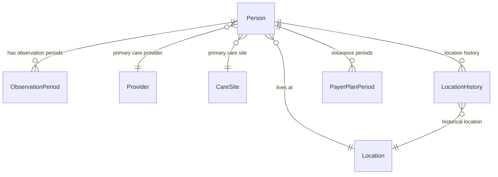
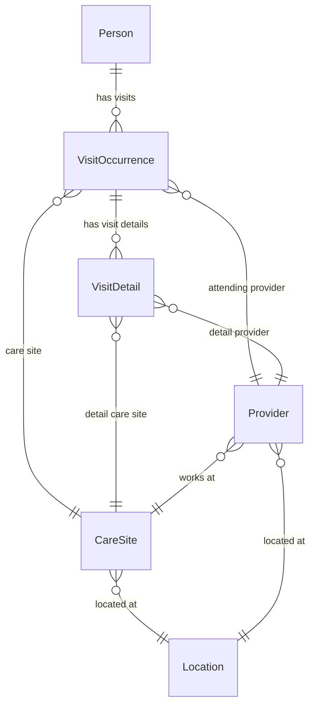
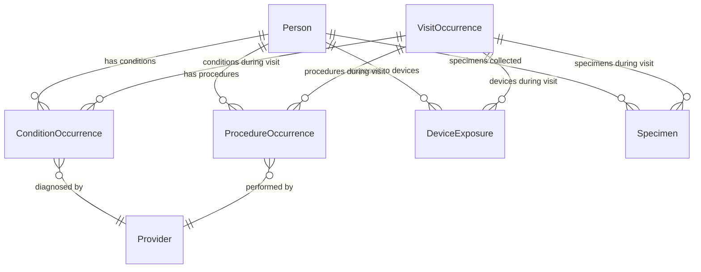
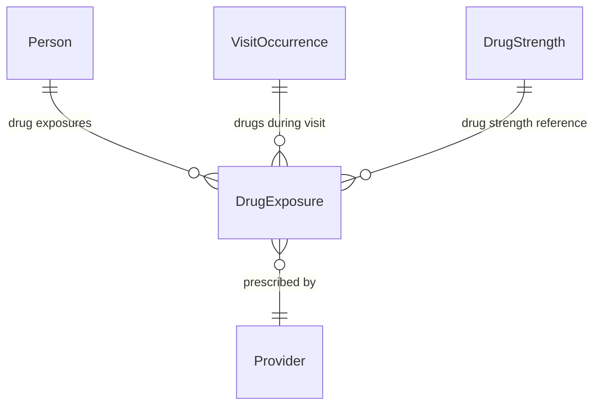
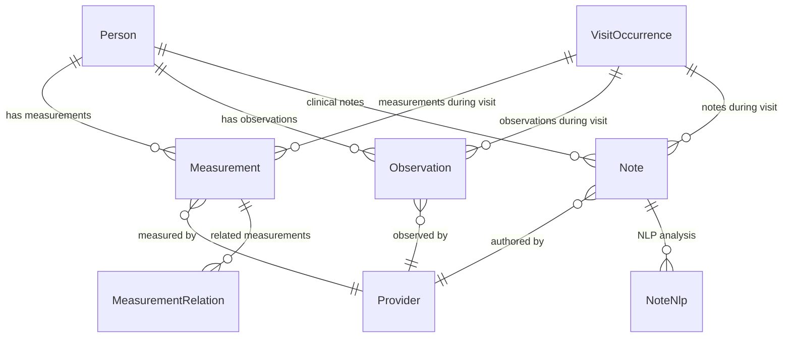
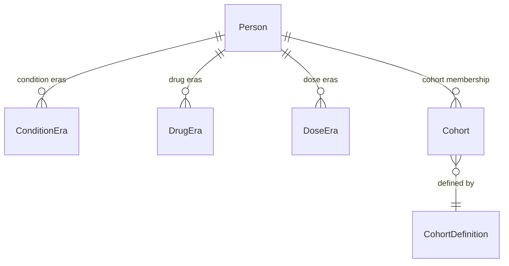
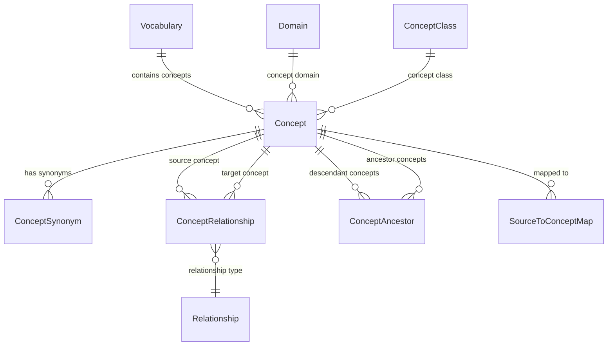
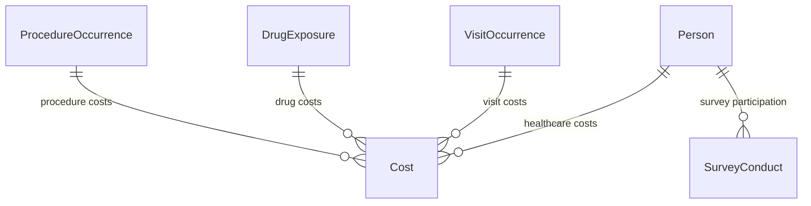
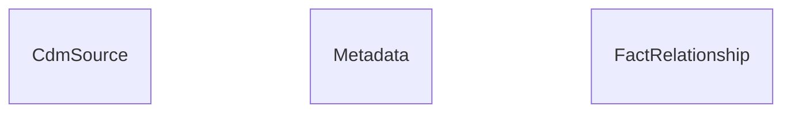

# OMOPDB SQLAlchemy Models - Entity Relationship Diagrams

This document contains simplified ERDs showing different functional areas of the OMOPDB SQLAlchemy models based on the OMOP Common Data Model.

## 1. Person and Demographics

## 2. Healthcare Visits and Care

## 3. Clinical Events and Conditions

## 4. Drug Exposures and Medications

## 5. Measurements and Observations

## 6. Eras and Cohorts

## 7. OMOP Vocabulary and Concepts

## 8. Cost and Survey Data

## 9. System Metadata and Relationships

## Key Model Groups

### 👥 **Core Person Data**
- **Person** - Demographics and basic information
- **ObservationPeriod** - Time periods when person was observable
- **LocationHistory** - Residential history

### 🏥 **Healthcare Delivery**
- **VisitOccurrence** - Healthcare visits and encounters
- **VisitDetail** - Detailed visit components
- **Provider** - Healthcare providers
- **CareSite** - Healthcare facilities

### 🩺 **Clinical Events**
- **ConditionOccurrence** - Diagnoses and conditions
- **ProcedureOccurrence** - Medical procedures
- **DeviceExposure** - Medical device usage
- **Specimen** - Laboratory specimens

### 💊 **Medications**
- **DrugExposure** - Drug prescriptions and administrations
- **DrugStrength** - Drug formulation information

### 📊 **Measurements & Observations**
- **Measurement** - Laboratory values, vital signs
- **Observation** - Clinical observations and assessments
- **Note** - Clinical notes and documentation

### 📈 **Longitudinal Analysis**
- **ConditionEra** - Continuous condition periods
- **DrugEra** - Continuous drug exposure periods
- **DoseEra** - Continuous dose periods

### 👨‍👩‍👧‍👦 **Cohorts and Studies**
- **Cohort** - Patient cohort membership
- **CohortDefinition** - Cohort inclusion criteria

### 📚 **Vocabulary System**
- **Vocabulary** - Standard vocabularies (SNOMED, ICD, etc.)
- **Concept** - Standardized medical concepts
- **ConceptRelationship** - Relationships between concepts
- **Domain** - Concept domains (Condition, Drug, etc.)

All clinical event entities include standardized concept references for interoperability and use the OMOP Common Data Model structure for healthcare data analysis.