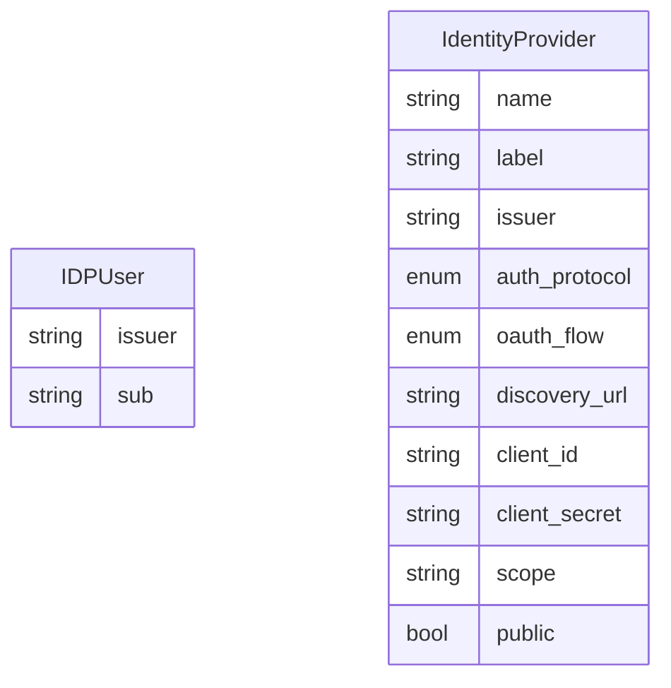

# seqdb / AUTH — Detailed ERD

Auto-generated.  Service type **AUTH** — 2 entities.

```mermaid
erDiagram
    %% seqdb / AUTH (detailed)

    %% Entity definitions
    IDPUser {
        string issuer
        string sub
    }

    IdentityProvider {
        string name
        string label
        string issuer
        enum auth_protocol
        enum oauth_flow
        string discovery_url
        string client_id
        string client_secret
        string scope
        bool public
    }

```
