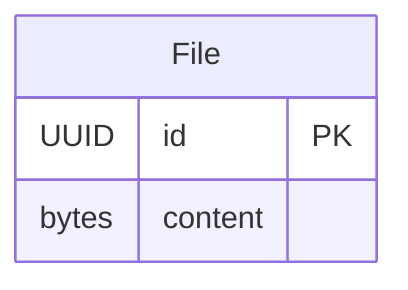

# seqdb / FILE — Detailed ERD

Auto-generated.  Service type **FILE** — 1 entities.

```mermaid
erDiagram
    %% seqdb / FILE (detailed)

    %% Entity definitions
    File {
        UUID id PK
        bytes content
    }

```
