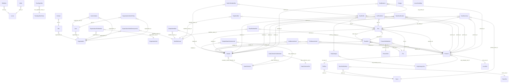

# seqdb — Simplified Entity-Relationship Diagram

Auto-generated from domain model definitions.  Contains **46** persistable entities — relationships only, no field details.

```mermaid
erDiagram
    %% seqdb — all persistable entities (simplified)

    %% Relationships
    Site }o--|| Organization : "organization_id"
    User }o--|| Organization : "organization_id"
    OrganizationSetMember }o--|| OrganizationSet : "organization_set_id"
    OrganizationSetMember }o--|| Organization : "organization_id"
    Sample }o--|| DataCollection : "created_in_data_collection_id"
    DataCollectionSetMember }o--|| DataCollectionSet : "data_collection_set_id"
    DataCollectionSetMember }o--|| DataCollection : "data_collection_id"
    OrganizationIdentifierIssuerLink }o--|| Organization : "organization_id"
    OrganizationIdentifierIssuerLink }o--|| IdentifierIssuer : "identifier_issuer_id"
    RefSeq }o--|| Taxon : "taxon_id"
    TaxonSetMember }o--|| TaxonSet : "taxon_set_id"
    TaxonSetMember }o--|| Taxon : "taxon_id"
    RefAllele }o--|| Locus : "locus_id"
    Allele }o--|| Locus : "locus_id"
    TreeAlgorithm }o--|| TreeAlgorithmClass : "tree_algorithm_class_id"
    SeqCategory }o--|| SeqCategorySet : "seq_category_set_id"
    Contact }o--|| Site : "site_id"
    UserInvitation }o--|| Organization : "organization_id"
    UserInvitation }o--|| User : "invited_by_user_id"
    OrganizationAdminPolicy }o--|| Organization : "organization_id"
    OrganizationAdminPolicy }o--|| User : "user_id"
    SampleDataCollectionLink }o--|| Sample : "sample_id"
    SampleDataCollectionLink }o--|| DataCollection : "data_collection_id"
    SampleIdentifier }o--|| IdentifierIssuer : "identifier_issuer_id"
    SampleIdentifier }o--|| Sample : "internal_id"
    Protocol }o--|| RefSeq : "ref_seq_id"
    Protocol }o--|| SeqCategorySet : "seq_category_set_id"
    Protocol }o--|| LocusSet : "locus_set_id"
    ProtocolSetMember }o--|| ProtocolSet : "protocol_set_id"
    ProtocolSetMember }o--|| Protocol : "protocol_id"
    ReadSet }o--|| Sample : "sample_id"
    ReadSet }o--|| Protocol : "protocol_id"
    ReadSet }o--|| File : "fwd_file_id"
    ReadSet }o--|| File : "rev_file_id"
    AstMeasurement }o--|| Sample : "sample_id"
    AstMeasurement }o--|| Protocol : "protocol_id"
    PcrMeasurement }o--|| Sample : "sample_id"
    PcrMeasurement }o--|| Protocol : "protocol_id"
    ReadSetIdentifier }o--|| IdentifierIssuer : "identifier_issuer_id"
    ReadSetIdentifier }o--|| ReadSet : "internal_id"
    Seq }o--|| Sample : "sample_id"
    Seq }o--|| File : "file_id"
    Seq }o--|| ReadSet : "read_set_id"
    Seq }o--|| ReadSet : "read_set2_id"
    Seq }o--|| Protocol : "protocol_id"
    SeqIdentifier }o--|| IdentifierIssuer : "identifier_issuer_id"
    SeqIdentifier }o--|| Seq : "internal_id"
    SeqProfile }o--|| Sample : "sample_id"
    SeqProfile }o--|| Seq : "seq_id"
    SeqProfile }o--|| Protocol : "protocol_id"
    AstPrediction }o--|| Sample : "sample_id"
    AstPrediction }o--|| Seq : "seq_id"
    AstPrediction }o--|| Protocol : "protocol_id"
    SeqClassification }o--|| Sample : "sample_id"
    SeqClassification }o--|| Seq : "seq_id"
    SeqClassification }o--|| Protocol : "protocol_id"
    SeqClassification }o--|| SeqCategory : "primary_category_id"
    SeqTaxonomy }o--|| Sample : "sample_id"
    SeqTaxonomy }o--|| Seq : "seq_id"
    SeqTaxonomy }o--|| Protocol : "protocol_id"
    SeqTaxonomy }o--|| Taxon : "primary_taxon_id"
    SeqProfileIdentifier }o--|| IdentifierIssuer : "identifier_issuer_id"
    SeqProfileIdentifier }o--|| SeqProfile : "internal_id"
    SeqDistance }o--|| Sample : "sample_id"
    SeqDistance }o--|| Protocol : "protocol_id"
    SeqDistance }o--|| SeqProfile : "seq_profile_id"

    Outage {
    }

    LocusCodeMap {
    }

```
