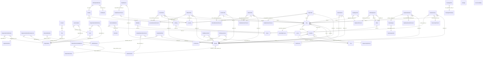

# seqdb — Simplified Entity-Relationship Diagram

Auto-generated from domain model definitions.  Contains **62** persistable entities — relationships only, no field details.

```mermaid
erDiagram
    %% seqdb — all persistable entities (simplified)

    %% Relationships
    OrganizationSetMember }o--|| OrganizationSet : "organization_set_id"
    OrganizationSetMember }o--|| Organization : "organization_id"
    DataCollectionSetMember }o--|| DataCollectionSet : "data_collection_set_id"
    DataCollectionSetMember }o--|| DataCollection : "data_collection_id"
    OrganizationIdentifierIssuerLink }o--|| Organization : "organization_id"
    OrganizationIdentifierIssuerLink }o--|| IdentifierIssuer : "identifier_issuer_id"
    ExternalIdentifier }o--|| IdentifierIssuer : "identifier_issuer_id"
    Site }o--|| Organization : "organization_id"
    Contact }o--|| Site : "site_id"
    User }o--|| Organization : "organization_id"
    UserInvitation }o--|| Organization : "organization_id"
    UserInvitation }o--|| User : "invited_by_user_id"
    OrganizationAdminPolicy }o--|| Organization : "organization_id"
    OrganizationAdminPolicy }o--|| User : "user_id"
    TaxonSetMember }o--|| TaxonSet : "taxon_set_id"
    TaxonSetMember }o--|| Taxon : "taxon_id"
    RefSeq }o--|| Taxon : "taxon_id"
    RefAllele }o--|| Locus : "locus_id"
    RefSnp }o--|| RefSeq : "ref_seq_id"
    RefSnpSetMember }o--|| RefSnpSet : "ref_snp_set_id"
    RefSnpSetMember }o--|| RefSnp : "ref_snp_id"
    SeqDistanceProtocol }o--|| LocusSet : "locus_set_id"
    SeqDistanceProtocol }o--|| RefSeq : "ref_seq_id"
    TreeAlgorithm }o--|| TreeAlgorithmClass : "tree_algorithm_class_id"
    SeqCategory }o--|| SeqCategorySet : "seq_category_set_id"
    Sample }o--|| DataCollection : "created_in_data_collection_id"
    SampleDataCollectionLink }o--|| Sample : "sample_id"
    SampleDataCollectionLink }o--|| DataCollection : "data_collection_id"
    SampleIdentifier }o--|| Sample : "sample_id"
    SampleIdentifier }o--|| IdentifierIssuer : "identifier_issuer_id"
    ReadSet }o--|| Sample : "sample_id"
    ReadSet }o--|| SequencingProtocol : "sequencing_protocol_id"
    ReadSet }o--|| File : "fwd_file_id"
    ReadSet }o--|| File : "rev_file_id"
    Seq }o--|| Sample : "sample_id"
    Seq }o--|| File : "file_id"
    Seq }o--|| ReadSet : "read_set_id"
    Seq }o--|| ReadSet : "read_set2_id"
    Seq }o--|| AssemblyProtocol : "assembly_protocol_id"
    Allele }o--|| Locus : "locus_id"
    LocusProfile }o--|| Sample : "sample_id"
    LocusProfile }o--|| Seq : "seq_id"
    LocusProfile }o--|| LocusSet : "locus_set_id"
    LocusProfile }o--|| LocusDetectionProtocol : "locus_detection_protocol_id"
    AlleleProfile }o--|| Sample : "sample_id"
    AlleleProfile }o--|| Seq : "seq_id"
    AlleleProfile }o--|| LocusSet : "locus_set_id"
    AlleleProfile }o--|| LocusDetectionProtocol : "locus_detection_protocol_id"
    KmerProfile }o--|| Sample : "sample_id"
    KmerProfile }o--|| Seq : "seq_id"
    KmerProfile }o--|| KmerDetectionProtocol : "kmer_detection_protocol_id"
    MlvaProfile }o--|| Sample : "sample_id"
    MlvaProfile }o--|| Seq : "seq_id"
    MlvaProfile }o--|| LocusSet : "locus_set_id"
    MlvaProfile }o--|| MlvaDetectionProtocol : "mlva_detection_protocol_id"
    SnpProfile }o--|| Sample : "sample_id"
    SnpProfile }o--|| Seq : "seq_id"
    SnpProfile }o--|| RefSeq : "ref_seq_id"
    SnpProfile }o--|| SnpDetectionProtocol : "snp_detection_protocol_id"
    AstMeasurement }o--|| Sample : "sample_id"
    AstMeasurement }o--|| AstProtocol : "ast_protocol_id"
    AstPrediction }o--|| Sample : "sample_id"
    AstPrediction }o--|| Seq : "seq_id"
    AstPrediction }o--|| AstProtocol : "ast_protocol_id"
    PcrMeasurement }o--|| Sample : "sample_id"
    PcrMeasurement }o--|| PcrProtocol : "pcr_protocol_id"
    SeqAlignment }o--|| Seq : "seq_id"
    SeqAlignment }o--|| AlignmentProtocol : "alignment_protocol_id"
    AlleleAlignment }o--|| Allele : "ref_allele_id"
    AlleleAlignment }o--|| Allele : "allele_id"
    AlleleAlignment }o--|| AlignmentProtocol : "alignment_protocol_id"
    SeqClassification }o--|| Sample : "sample_id"
    SeqClassification }o--|| Seq : "seq_id"
    SeqClassification }o--|| SeqClassificationProtocol : "seq_classification_protocol_id"
    SeqClassification }o--|| SeqCategory : "primary_category_id"
    SeqDistance }o--|| Sample : "sample_id"
    SeqDistance }o--|| SeqDistanceProtocol : "seq_distance_protocol_id"
    SeqTaxonomy }o--|| Sample : "sample_id"
    SeqTaxonomy }o--|| Seq : "seq_id"
    SeqTaxonomy }o--|| TaxonomyProtocol : "taxonomy_protocol_id"
    SeqTaxonomy }o--|| Taxon : "primary_taxon_id"

    Outage {
    }

    LocusCodeMap {
    }

```
