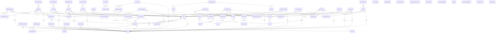

# seqdb / SEQ — Simplified ERD

Auto-generated.  Service type **SEQ** — 69 entities, relationships only.

```mermaid
erDiagram
    %% seqdb / SEQ (simplified)

    %% Relationships
    MlvaProfileForUpload }o--|| Sample : "sample_id"
    MlvaProfileForUpload }o--|| Seq : "seq_id"
    MlvaProfileForUpload }o--|| LocusSet : "locus_set_id"
    MlvaProfileForUpload }o--|| MlvaDetectionProtocol : "mlva_detection_protocol_id"
    ReadSetIdentifier }o--|| ReadSet : "internal_id"
    KmerProfileIdentifier }o--|| KmerProfile : "internal_id"
    LocusProfileIdentifier }o--|| LocusProfile : "internal_id"
    SampleDataCollectionLink }o--|| Sample : "sample_id"
    RefSnp }o--|| RefSeq : "ref_seq_id"
    ReadSetForUpload }o--|| Sample : "sample_id"
    ReadSetForUpload }o--|| SequencingProtocol : "sequencing_protocol_id"
    AlleleProfile }o--|| Sample : "sample_id"
    AlleleProfile }o--|| Seq : "seq_id"
    AlleleProfile }o--|| LocusSet : "locus_set_id"
    AlleleProfile }o--|| LocusDetectionProtocol : "locus_detection_protocol_id"
    SeqIdentifier }o--|| Seq : "internal_id"
    RefSeq }o--|| Taxon : "taxon_id"
    SnpProfile }o--|| Sample : "sample_id"
    SnpProfile }o--|| Seq : "seq_id"
    SnpProfile }o--|| RefSeq : "ref_seq_id"
    SnpProfile }o--|| SnpDetectionProtocol : "snp_detection_protocol_id"
    SeqDistance }o--|| Sample : "sample_id"
    SeqDistance }o--|| SeqDistanceProtocol : "seq_distance_protocol_id"
    AstMeasurement }o--|| Sample : "sample_id"
    AstMeasurement }o--|| AstProtocol : "ast_protocol_id"
    KmerProfileForUpload }o--|| Sample : "sample_id"
    KmerProfileForUpload }o--|| Seq : "seq_id"
    KmerProfileForUpload }o--|| KmerDetectionProtocol : "kmer_detection_protocol_id"
    MlvaProfileIdentifier }o--|| MlvaProfile : "internal_id"
    Allele }o--|| Locus : "locus_id"
    TreeAlgorithm }o--|| TreeAlgorithmClass : "tree_algorithm_class_id"
    AlleleAlignment }o--|| Allele : "ref_allele_id"
    AlleleAlignment }o--|| Allele : "allele_id"
    AlleleAlignment }o--|| AlignmentProtocol : "alignment_protocol_id"
    AlleleProfileIdentifier }o--|| AlleleProfile : "internal_id"
    PcrMeasurement }o--|| Sample : "sample_id"
    PcrMeasurement }o--|| PcrProtocol : "pcr_protocol_id"
    SeqForUpload }o--|| Sample : "sample_id"
    SeqForUpload }o--|| ReadSet : "read_set_id"
    SeqForUpload }o--|| ReadSet : "read_set2_id"
    SeqForUpload }o--|| AssemblyProtocol : "assembly_protocol_id"
    LocusProfile }o--|| Sample : "sample_id"
    LocusProfile }o--|| Seq : "seq_id"
    LocusProfile }o--|| LocusSet : "locus_set_id"
    LocusProfile }o--|| LocusDetectionProtocol : "locus_detection_protocol_id"
    SnpProfileIdentifier }o--|| SnpProfile : "internal_id"
    SeqClassification }o--|| Sample : "sample_id"
    SeqClassification }o--|| Seq : "seq_id"
    SeqClassification }o--|| SeqClassificationProtocol : "seq_classification_protocol_id"
    SeqClassification }o--|| SeqCategory : "primary_category_id"
    SampleIdentifier }o--|| Sample : "internal_id"
    RefSnpSetMember }o--|| RefSnpSet : "ref_snp_set_id"
    RefSnpSetMember }o--|| RefSnp : "ref_snp_id"
    SeqDistanceProtocol }o--|| LocusSet : "locus_set_id"
    SeqDistanceProtocol }o--|| RefSeq : "ref_seq_id"
    AlleleProfileForUpload }o--|| Sample : "sample_id"
    AlleleProfileForUpload }o--|| Seq : "seq_id"
    AlleleProfileForUpload }o--|| LocusSet : "locus_set_id"
    AlleleProfileForUpload }o--|| LocusDetectionProtocol : "locus_detection_protocol_id"
    SnpProfileForUpload }o--|| Sample : "sample_id"
    SnpProfileForUpload }o--|| Seq : "seq_id"
    SnpProfileForUpload }o--|| RefSeq : "ref_seq_id"
    SnpProfileForUpload }o--|| SnpDetectionProtocol : "snp_detection_protocol_id"
    ReadSet }o--|| Sample : "sample_id"
    ReadSet }o--|| SequencingProtocol : "sequencing_protocol_id"
    SeqTaxonomy }o--|| Sample : "sample_id"
    SeqTaxonomy }o--|| Seq : "seq_id"
    SeqTaxonomy }o--|| TaxonomyProtocol : "taxonomy_protocol_id"
    SeqTaxonomy }o--|| Taxon : "primary_taxon_id"
    KmerProfile }o--|| Sample : "sample_id"
    KmerProfile }o--|| Seq : "seq_id"
    KmerProfile }o--|| KmerDetectionProtocol : "kmer_detection_protocol_id"
    RefAllele }o--|| Locus : "locus_id"
    TaxonSetMember }o--|| TaxonSet : "taxon_set_id"
    TaxonSetMember }o--|| Taxon : "taxon_id"
    SeqCategory }o--|| SeqCategorySet : "seq_category_set_id"
    MlvaProfile }o--|| Sample : "sample_id"
    MlvaProfile }o--|| Seq : "seq_id"
    MlvaProfile }o--|| LocusSet : "locus_set_id"
    MlvaProfile }o--|| MlvaDetectionProtocol : "mlva_detection_protocol_id"
    Seq }o--|| Sample : "sample_id"
    Seq }o--|| ReadSet : "read_set_id"
    Seq }o--|| ReadSet : "read_set2_id"
    Seq }o--|| AssemblyProtocol : "assembly_protocol_id"
    SeqAlignment }o--|| Seq : "seq_id"
    SeqAlignment }o--|| AlignmentProtocol : "alignment_protocol_id"
    AlleleForUpload }o--|| Locus : "locus_id"
    AstPrediction }o--|| Sample : "sample_id"
    AstPrediction }o--|| Seq : "seq_id"
    AstPrediction }o--|| AstProtocol : "ast_protocol_id"

    LocusCodeMap {
    }

    MultipleAlignment {
    }

    SampleUploadResult {
    }

    CalculateSeqDistancesResult {
    }

    PhylogeneticTree {
    }

    SampleBatchForUpload {
    }

    BaseSeq {
    }

    SampleBatchUploadResult {
    }

    SampleForUpload {
    }

    ContigAlignment {
    }

```
