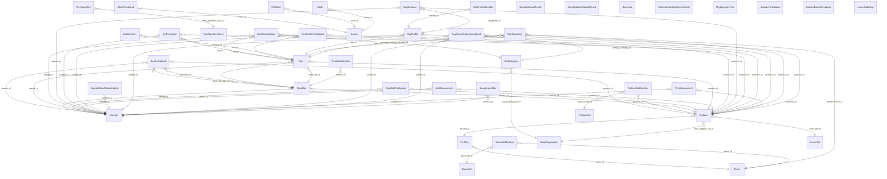

# seqdb / SEQ — Simplified ERD

Auto-generated.  Service type **SEQ** — 43 entities, relationships only.

```mermaid
erDiagram
    %% seqdb / SEQ (simplified)

    %% Relationships
    SampleIdentifier }o--|| Sample : "internal_id"
    TaxonSetMember }o--|| TaxonSet : "taxon_set_id"
    TaxonSetMember }o--|| Taxon : "taxon_id"
    SeqClassificationForUpload }o--|| Sample : "sample_id"
    SeqClassificationForUpload }o--|| Seq : "seq_id"
    SeqClassificationForUpload }o--|| Protocol : "protocol_id"
    SeqClassificationForUpload }o--|| SeqCategory : "primary_category_id"
    PcrMeasurement }o--|| Sample : "sample_id"
    PcrMeasurement }o--|| Protocol : "protocol_id"
    SeqTaxonomy }o--|| Sample : "sample_id"
    SeqTaxonomy }o--|| Seq : "seq_id"
    SeqTaxonomy }o--|| Protocol : "protocol_id"
    SeqTaxonomy }o--|| Taxon : "primary_taxon_id"
    SeqProfile }o--|| Sample : "sample_id"
    SeqProfile }o--|| Seq : "seq_id"
    SeqProfile }o--|| Protocol : "protocol_id"
    TreeAlgorithm }o--|| TreeAlgorithmClass : "tree_algorithm_class_id"
    SeqIdentifier }o--|| Seq : "internal_id"
    ReadSetIdentifier }o--|| ReadSet : "internal_id"
    SampleDataCollectionLink }o--|| Sample : "sample_id"
    SeqProfileForUpload }o--|| Sample : "sample_id"
    SeqProfileForUpload }o--|| Seq : "seq_id"
    SeqProfileForUpload }o--|| Protocol : "protocol_id"
    Allele }o--|| Locus : "locus_id"
    Protocol }o--|| RefSeq : "ref_seq_id"
    Protocol }o--|| SeqCategorySet : "seq_category_set_id"
    Protocol }o--|| LocusSet : "locus_set_id"
    RefAllele }o--|| Locus : "locus_id"
    SeqCategory }o--|| SeqCategorySet : "seq_category_set_id"
    AlleleForUpload }o--|| Locus : "locus_id"
    AstPrediction }o--|| Sample : "sample_id"
    AstPrediction }o--|| Seq : "seq_id"
    AstPrediction }o--|| Protocol : "protocol_id"
    SeqDistance }o--|| Sample : "sample_id"
    SeqDistance }o--|| Protocol : "protocol_id"
    SeqDistance }o--|| SeqProfile : "seq_profile_id"
    SeqClassification }o--|| Sample : "sample_id"
    SeqClassification }o--|| Seq : "seq_id"
    SeqClassification }o--|| Protocol : "protocol_id"
    SeqClassification }o--|| SeqCategory : "primary_category_id"
    AstMeasurement }o--|| Sample : "sample_id"
    AstMeasurement }o--|| Protocol : "protocol_id"
    Seq }o--|| Sample : "sample_id"
    Seq }o--|| ReadSet : "read_set_id"
    Seq }o--|| ReadSet : "read_set2_id"
    Seq }o--|| Protocol : "protocol_id"
    ReadSetForUpload }o--|| Sample : "sample_id"
    ReadSetForUpload }o--|| Protocol : "protocol_id"
    ReadSet }o--|| Sample : "sample_id"
    ReadSet }o--|| Protocol : "protocol_id"
    SeqProfileIdentifier }o--|| SeqProfile : "internal_id"
    ProtocolSetMember }o--|| ProtocolSet : "protocol_set_id"
    ProtocolSetMember }o--|| Protocol : "protocol_id"
    RefSeq }o--|| Taxon : "taxon_id"
    SeqForUpload }o--|| Sample : "sample_id"
    SeqForUpload }o--|| ReadSet : "read_set_id"
    SeqForUpload }o--|| ReadSet : "read_set2_id"
    SeqForUpload }o--|| Protocol : "protocol_id"

    SampleUploadResult {
    }

    SampleBatchUploadResult {
    }

    BaseSeq {
    }

    CalculateSeqDistancesResult {
    }

    PhylogeneticTree {
    }

    SampleForUpload {
    }

    SampleBatchForUpload {
    }

    LocusCodeMap {
    }

```
