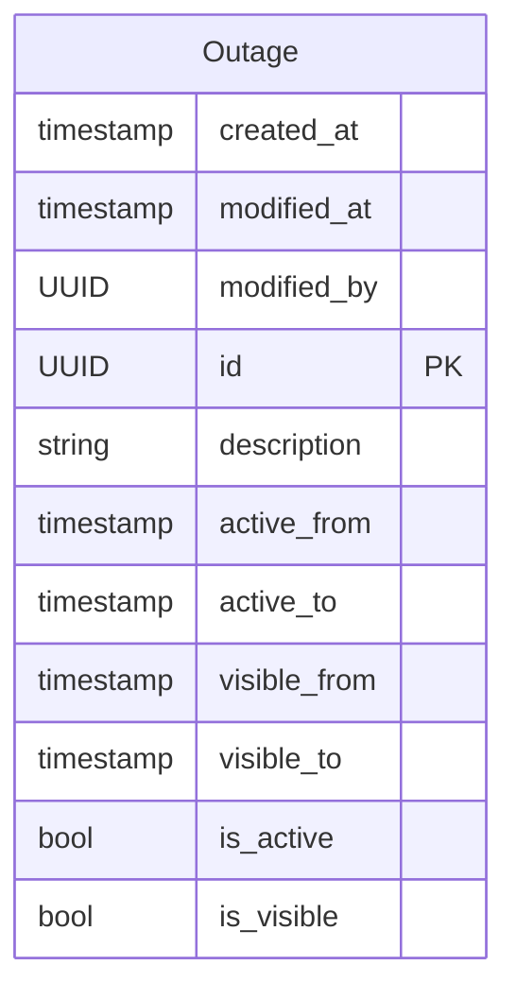

# seqdb / SYSTEM — Detailed ERD

Auto-generated.  Service type **SYSTEM** — 1 entities.

```mermaid
erDiagram
    %% seqdb / SYSTEM (detailed)

    %% Entity definitions
    Outage {
        timestamp created_at
        timestamp modified_at
        UUID modified_by
        UUID id PK
        string description
        timestamp active_from
        timestamp active_to
        timestamp visible_from
        timestamp visible_to
        bool is_active
        bool is_visible
    }

```
