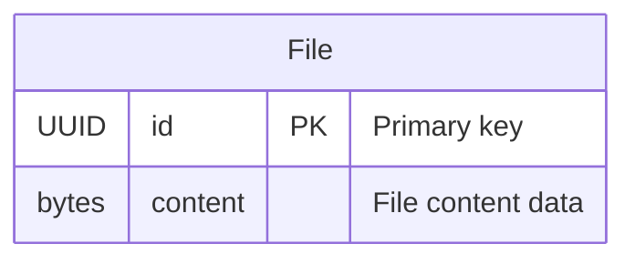

# SeqDB File Model - Entity Relationship Diagram

This ERD shows the File model defined in `gen_epix/seqdb/repositories/sa_model/file.py`.

## File Model Overview

The **File** entity is a simple storage model for file content in the SeqDB service:

### 📁 **File Entity**
- **Purpose**: Stores raw file content as binary data
- **Usage**: Referenced by other models that need to store file data
- **Key Features**:
  - UUID primary key for unique identification
  - Binary content storage for any file type
  - No metadata mixins (minimal storage model)

### 🔗 **Relationships**
The File model is referenced by various SeqDB entities:
- **ReadSet**: Links to forward/reverse read files via `fwd_file_id` and `rev_file_id`
- **Seq**: Links to assembled sequence files via `file_id`

### 💾 **Storage Pattern**
This follows the Gen-EpiX pattern of separating file metadata (stored in ReadSet/Seq) from file content (stored in File):
- **Metadata**: URI, format, compression, hashes stored in ReadSet/Seq
- **Content**: Raw binary data stored in File
- **Benefits**: Efficient storage, flexible file handling, clean separation of concerns