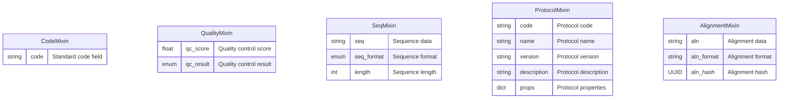

# SeqDB Base Mixins - Entity Relationship Diagram

This ERD shows the SQLAlchemy mixin classes defined in `gen_epix/seqdb/repositories/sa_model/base.py`.

## Mixin Usage Overview

These mixins are used by various SeqDB models to provide common field sets:

### 🏷️ **CodeMixin**
Used by models that need a standard code field:
- Sample, ReadSet, Seq
- RefSeq, LocusSet
- SeqCategory, Taxon

### 🔬 **QualityMixin** 
Used by models with quality control data:
- ReadSet, Seq
- AlleleProfile, LocusProfile, SnpProfile
- KmerProfile, MlvaProfile
- AlleleAlignment

### 🧬 **SeqMixin**
Used by models that store sequence data:
- Allele, RefAllele, RefSeq
- Combined with RowMetadataMixin

### ⚙️ **ProtocolMixin**
Used by all protocol models:
- SequencingProtocol, AssemblyProtocol
- AlignmentProtocol, LocusDetectionProtocol
- SnpDetectionProtocol, KmerDetectionProtocol
- SeqClassificationProtocol, AstProtocol
- PcrProtocol, TaxonomyProtocol

### 🔗 **AlignmentMixin**
Used by alignment result models:
- AlleleAlignment, SeqAlignment

These mixins promote code reuse and ensure consistent field definitions across the SeqDB schema.