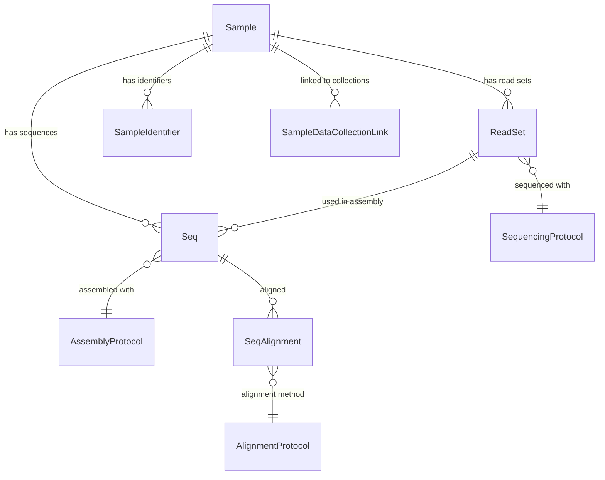
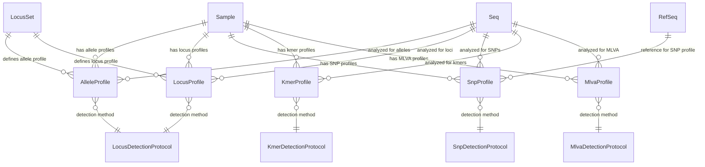
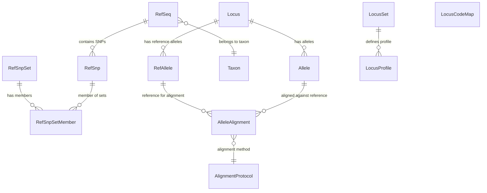
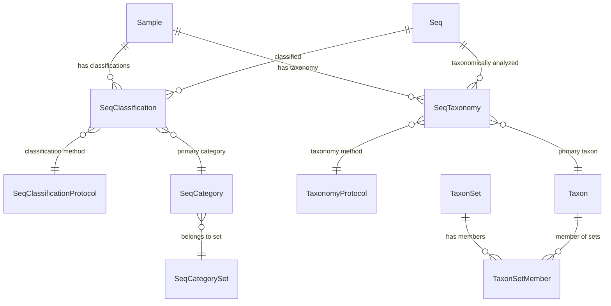
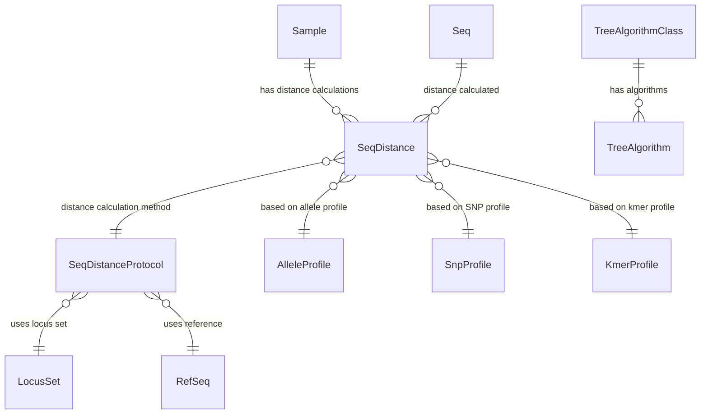
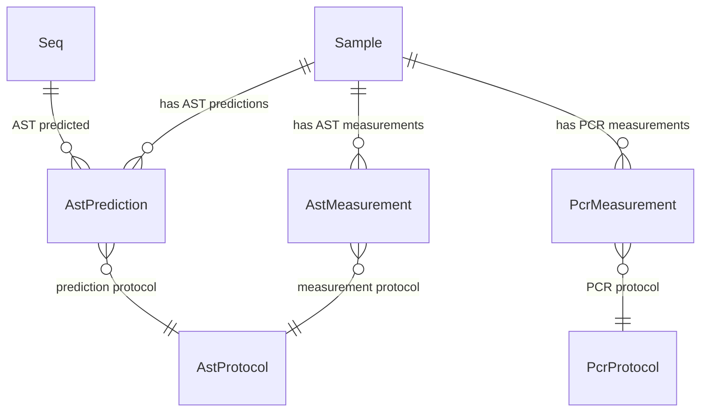

# SeqDB SQLAlchemy Models - Simplified Entity Relationship Diagrams

This document contains multiple simplified ERDs showing different functional areas of the SeqDB SQLAlchemy models, with core entities duplicated across diagrams for clarity.

## 1. Core Sample and Sequence Workflow

## 2. Genomic Profile Analysis

## 3. Reference Data and Genetic Elements

## 4. Classification and Taxonomy

## 5. Distance Analysis and Phylogenetics

## 6. Laboratory Measurements

## Entity Groups Overview

### 🧬 Core Data Entities
- **Sample** - Biological samples
- **Seq** - Assembled genomic sequences  
- **ReadSet** - Raw sequencing data
- **Allele** - Genetic variants
- **Locus** - Gene locations

### 📊 Analysis Profiles
- **AlleleProfile** - MLST results
- **SnpProfile** - SNP analysis
- **LocusProfile** - Gene detection
- **KmerProfile** - K-mer analysis
- **MlvaProfile** - VNTR analysis

### 🔬 Analysis Results
- **SeqClassification** - Sequence classification
- **SeqTaxonomy** - Taxonomic assignment
- **SeqDistance** - Phylogenetic distances
- **SeqAlignment** - Sequence alignments

### 🧪 Laboratory Results
- **AstMeasurement/AstPrediction** - Antimicrobial susceptibility
- **PcrMeasurement** - PCR results

### 📋 Reference Data
- **RefSeq** - Reference genomes
- **RefAllele** - Reference alleles
- **RefSnp** - Reference SNPs
- **Taxon** - Taxonomic data
- **LocusSet** - Locus collections

### ⚙️ Analysis Protocols
- **SequencingProtocol** - Sequencing methods
- **AssemblyProtocol** - Assembly methods
- **AlignmentProtocol** - Alignment methods
- **LocusDetectionProtocol** - Locus detection
- **SnpDetectionProtocol** - SNP detection
- **KmerDetectionProtocol** - K-mer detection
- **MlvaDetectionProtocol** - MLVA detection
- **SeqClassificationProtocol** - Classification methods
- **SeqDistanceProtocol** - Distance calculation
- **AstProtocol** - AST methods
- **PcrProtocol** - PCR methods
- **TaxonomyProtocol** - Taxonomy methods

### 🔗 Supporting Entities
- **SampleIdentifier** - Sample IDs from external systems
- **SampleDataCollectionLink** - Sample collection associations
- **AlleleAlignment** - Allele alignment results
- **RefSnpSet/RefSnpSetMember** - SNP collections
- **SeqCategory/SeqCategorySet** - Classification categories
- **TaxonSet/TaxonSetMember** - Taxonomic collections
- **TreeAlgorithm/TreeAlgorithmClass** - Phylogenetic methods
- **LocusCodeMap** - Locus code mappings

This simplified view shows the high-level data flow: **Sample** → **ReadSet** → **Seq** → **Analysis Results** (Profiles, Classifications, etc.), with **Reference Data** and **Protocols** supporting the analysis pipeline.