# SeqDB SQLAlchemy Models - Entity Relationship Diagram

This ERD represents the SQLAlchemy models defined in `gen_epix/seqdb/repositories/sa_model/seq.py`.

```mermaid
erDiagram
    %% Core Sample and Sequence Entities
    Sample ||--o{ Seq : "has sequences"
    Sample ||--o{ ReadSet : "has read sets"
    Sample ||--o{ SampleIdentifier : "has identifiers"
    Sample ||--o{ SampleDataCollectionLink : "linked to collections"
    
    %% ReadSet and Seq relationships
    ReadSet ||--o{ Seq : "used in assembly"
    Seq }o--|| AssemblyProtocol : "assembled with"
    ReadSet }o--|| SequencingProtocol : "sequenced with"
    
    %% Profiles and Analysis Results
    Sample ||--o{ AlleleProfile : "has allele profiles"
    Sample ||--o{ LocusProfile : "has locus profiles"
    Sample ||--o{ KmerProfile : "has kmer profiles"
    Sample ||--o{ SnpProfile : "has SNP profiles"
    Sample ||--o{ MlvaProfile : "has MLVA profiles"
    Sample ||--o{ SeqClassification : "has classifications"
    Sample ||--o{ SeqTaxonomy : "has taxonomy"
    Sample ||--o{ SeqDistance : "has distance calculations"
    Sample ||--o{ AstMeasurement : "has AST measurements"
    Sample ||--o{ AstPrediction : "has AST predictions"
    Sample ||--o{ PcrMeasurement : "has PCR measurements"
    
    %% Seq-based analyses
    Seq ||--o{ AlleleProfile : "analyzed for alleles"
    Seq ||--o{ LocusProfile : "analyzed for loci"
    Seq ||--o{ KmerProfile : "analyzed for kmers"
    Seq ||--o{ SnpProfile : "analyzed for SNPs"
    Seq ||--o{ MlvaProfile : "analyzed for MLVA"
    Seq ||--o{ SeqClassification : "classified"
    Seq ||--o{ SeqTaxonomy : "taxonomically analyzed"
    Seq ||--o{ SeqDistance : "distance calculated"
    Seq ||--o{ AstPrediction : "AST predicted"
    Seq ||--o{ SeqAlignment : "aligned"
    
    %% Reference Data
    Locus ||--o{ Allele : "has alleles"
    Locus ||--o{ RefAllele : "has reference alleles"
    LocusSet ||--o{ AlleleProfile : "defines allele profile"
    LocusSet ||--o{ LocusProfile : "defines locus profile"
    LocusSet }o--|| SeqDistanceProtocol : "used in distance calculation"
    
    RefSeq ||--o{ RefSnp : "contains SNPs"
    RefSeq ||--o{ SnpProfile : "reference for SNP profile"
    RefSeq }o--|| SeqDistanceProtocol : "used in distance calculation"
    RefSeq }o--|| Taxon : "belongs to taxon"
    
    RefSnpSet ||--o{ RefSnpSetMember : "has members"
    RefSnp ||--o{ RefSnpSetMember : "member of sets"
    
    %% Protocol Relationships
    AlignmentProtocol ||--o{ AlleleAlignment : "alignment method"
    AlignmentProtocol ||--o{ SeqAlignment : "alignment method"
    
    LocusDetectionProtocol ||--o{ AlleleProfile : "detection method"
    LocusDetectionProtocol ||--o{ LocusProfile : "detection method"
    
    KmerDetectionProtocol ||--o{ KmerProfile : "detection method"
    MlvaDetectionProtocol ||--o{ MlvaProfile : "detection method"
    SnpDetectionProtocol ||--o{ SnpProfile : "detection method"
    
    SeqClassificationProtocol ||--o{ SeqClassification : "classification method"
    SeqDistanceProtocol ||--o{ SeqDistance : "distance calculation method"
    
    AstProtocol ||--o{ AstMeasurement : "measurement protocol"
    AstProtocol ||--o{ AstPrediction : "prediction protocol"
    PcrProtocol ||--o{ PcrMeasurement : "PCR protocol"
    
    TaxonomyProtocol ||--o{ SeqTaxonomy : "taxonomy method"
    
    %% Allele and Alignment relationships
    RefAllele ||--o{ AlleleAlignment : "reference for alignment"
    Allele ||--o{ AlleleAlignment : "aligned against reference"
    
    %% Taxonomy and Classification
    Taxon ||--o{ SeqTaxonomy : "primary taxon"
    TaxonSet ||--o{ TaxonSetMember : "has members"
    Taxon ||--o{ TaxonSetMember : "member of sets"
    
    SeqCategory }o--|| SeqCategorySet : "belongs to set"
    SeqCategory ||--o{ SeqClassification : "primary category"
    
    %% Tree Analysis
    TreeAlgorithmClass ||--o{ TreeAlgorithm : "has algorithms"
    
    %% Entities Definitions
    Sample {
        UUID id PK
        UUID created_in_data_collection_id FK
        string code
        dict props
        timestamp created_at
        timestamp updated_at
        UUID created_by
        UUID updated_by
    }
    
    Seq {
        UUID id PK
        UUID sample_id FK
        string code
        string uri
        UUID file_id
        enum file_format
        enum file_compression
        UUID file_hash
        UUID read_set_id FK
        UUID read_set2_id FK
        UUID assembly_protocol_id FK
        list contigs
        UUID seq_hash
        bool is_available
        int n_contigs
        int length
        int max_contig_length
        int min_contig_length
        float median_contig_length
        int n50
        float qc_score
        enum qc_result
        timestamp created_at
        timestamp updated_at
    }
    
    ReadSet {
        UUID id PK
        UUID sample_id FK
        string code
        string fwd_uri
        string rev_uri
        UUID fwd_file_id
        UUID rev_file_id
        enum file_format
        enum file_compression
        UUID fwd_reads_hash
        UUID rev_reads_hash
        UUID sequencing_protocol_id FK
        string sequencing_run_code
        bool is_available
        float qc_score
        enum qc_result
        timestamp created_at
        timestamp updated_at
    }
    
    Allele {
        UUID id PK
        UUID locus_id FK
        string seq
        enum seq_format
        int length
        timestamp created_at
        timestamp updated_at
    }
    
    Locus {
        UUID id PK
        string code
        string name
        string description
        enum locus_type
        string gene_product_code
        timestamp created_at
        timestamp updated_at
    }
    
    LocusSet {
        UUID id PK
        string code
        string name
        int n_loci
        list locus_ids
        timestamp created_at
        timestamp updated_at
    }
    
    RefSeq {
        UUID id PK
        string code
        string name
        string description
        UUID taxon_id FK
        string genbank_accession_code
        string seq
        enum seq_format
        int length
        timestamp created_at
        timestamp updated_at
    }
    
    RefAllele {
        UUID id PK
        UUID locus_id FK
        int index
        string seq
        enum seq_format
        int length
        timestamp created_at
        timestamp updated_at
    }
    
    AlleleProfile {
        UUID id PK
        UUID sample_id FK
        UUID seq_id FK
        UUID locus_set_id FK
        UUID locus_detection_protocol_id FK
        int n_loci
        string allele_profile
        string allele_profile_format
        UUID allele_profile_hash
        float qc_score
        enum qc_result
        timestamp created_at
        timestamp updated_at
    }
    
    SnpProfile {
        UUID id PK
        UUID sample_id FK
        UUID seq_id FK
        UUID ref_seq_id FK
        UUID snp_detection_protocol_id FK
        string snp_profile
        string snp_profile_format
        UUID snp_profile_hash
        float qc_score
        enum qc_result
        timestamp created_at
        timestamp updated_at
    }
    
    SeqClassification {
        UUID id PK
        UUID sample_id FK
        UUID seq_id FK
        UUID seq_classification_protocol_id FK
        UUID primary_category_id FK
        string classification
        string classification_format
        UUID classification_hash
        timestamp created_at
        timestamp updated_at
    }
    
    SeqTaxonomy {
        UUID id PK
        UUID sample_id FK
        UUID seq_id FK
        UUID taxonomy_protocol_id FK
        UUID primary_taxon_id FK
        string taxonomy
        string taxonomy_format
        UUID taxonomy_hash
        timestamp created_at
        timestamp updated_at
    }
    
    Taxon {
        UUID id PK
        string code
        string name
        string rank
        int ncbi_taxid
        string ictv_ictv_id
        int snomed_sctid
        list ncbi_ancestor_taxids
        list ancestor_taxon_ids
        timestamp created_at
        timestamp updated_at
    }
    
    SequencingProtocol {
        UUID id PK
        string code
        string name
        string version
        string description
        dict props
        timestamp created_at
        timestamp updated_at
    }
    
    AssemblyProtocol {
        UUID id PK
        string code
        string name
        string version
        string description
        dict props
        bool has_manual_curation
        timestamp created_at
        timestamp updated_at
    }
    
    LocusDetectionProtocol {
        UUID id PK
        string code
        string name
        string version
        string description
        dict props
        timestamp created_at
        timestamp updated_at
    }
    
    SnpDetectionProtocol {
        UUID id PK
        string code
        string name
        string version
        string description
        dict props
        timestamp created_at
        timestamp updated_at
    }
    
    SeqClassificationProtocol {
        UUID id PK
        string code
        string name
        string version
        string description
        dict props
        bool is_taxonomic
        timestamp created_at
        timestamp updated_at
    }
    
    AstProtocol {
        UUID id PK
        string code
        string name
        string version
        string description
        dict props
        list antimicrobial_names
        bool is_predicted
        timestamp created_at
        timestamp updated_at
    }
    
    SampleIdentifier {
        UUID id PK
        UUID sample_id FK
        UUID identifier_issuer_id FK
        string identifier
        timestamp created_at
        timestamp updated_at
    }
    
    SampleDataCollectionLink {
        UUID id PK
        UUID sample_id FK
        UUID data_collection_id FK
        timestamp created_at
        timestamp updated_at
    }
    
    AlleleAlignment {
        UUID id PK
        UUID ref_allele_id FK
        UUID allele_id FK
        UUID alignment_protocol_id FK
        string aln
        string aln_format
        UUID aln_hash
        float qc_score
        enum qc_result
        timestamp created_at
        timestamp updated_at
    }
    
    SeqAlignment {
        UUID id PK
        UUID seq_id FK
        UUID alignment_protocol_id FK
        list contig_alignments
        timestamp created_at
        timestamp updated_at
    }
    
    AlignmentProtocol {
        UUID id PK
        string code
        string name
        string version
        string description
        dict props
        bool is_multiple
        timestamp created_at
        timestamp updated_at
    }
    
    SeqDistance {
        UUID id PK
        UUID sample_id FK
        UUID seq_id FK
        UUID seq_distance_protocol_id FK
        UUID allele_profile_id FK
        UUID snp_profile_id FK
        UUID kmer_profile_id FK
        string distance_format
        string distances
        timestamp created_at
        timestamp updated_at
    }
    
    SeqDistanceProtocol {
        UUID id PK
        string code
        string name
        string version
        string description
        dict props
        bool is_integer_distance
        enum seq_distance_protocol_type
        UUID locus_set_id FK
        UUID ref_seq_id FK
        float max_stored_distance
        timestamp created_at
        timestamp updated_at
    }
    
    LocusProfile {
        UUID id PK
        UUID sample_id FK
        UUID seq_id FK
        UUID locus_set_id FK
        UUID locus_detection_protocol_id FK
        int n_loci
        string locus_profile
        string locus_profile_format
        UUID locus_profile_hash
        float qc_score
        enum qc_result
        timestamp created_at
        timestamp updated_at
    }
    
    KmerProfile {
        UUID id PK
        UUID sample_id FK
        UUID seq_id FK
        UUID kmer_detection_protocol_id FK
        string kmer_profile
        string kmer_profile_format
        UUID kmer_profile_hash
        float qc_score
        enum qc_result
        timestamp created_at
        timestamp updated_at
    }
    
    KmerDetectionProtocol {
        UUID id PK
        string code
        string name
        string version
        string description
        dict props
        timestamp created_at
        timestamp updated_at
    }
    
    MlvaProfile {
        UUID id PK
        UUID sample_id FK
        UUID seq_id FK
        UUID mlva_detection_protocol_id FK
        string mlva_profile
        string mlva_profile_format
        UUID mlva_profile_hash
        float qc_score
        enum qc_result
        timestamp created_at
        timestamp updated_at
    }
    
    MlvaDetectionProtocol {
        UUID id PK
        string code
        string name
        string version
        string description
        dict props
        timestamp created_at
        timestamp updated_at
    }
    
    AstMeasurement {
        UUID id PK
        UUID sample_id FK
        UUID ast_protocol_id FK
        string ast_result
        string ast_result_format
        int index
        timestamp created_at
        timestamp updated_at
    }
    
    AstPrediction {
        UUID id PK
        UUID sample_id FK
        UUID seq_id FK
        UUID ast_protocol_id FK
        string ast_result
        string ast_result_format
        timestamp created_at
        timestamp updated_at
    }
    
    PcrMeasurement {
        UUID id PK
        UUID sample_id FK
        UUID pcr_protocol_id FK
        string pcr_result
        string pcr_result_format
        int index
        timestamp created_at
        timestamp updated_at
    }
    
    PcrProtocol {
        UUID id PK
        string code
        string name
        string version
        string description
        dict props
        list target_names
        timestamp created_at
        timestamp updated_at
    }
    
    RefSnp {
        UUID id PK
        string code
        string ref_seq_id FK
        string position
        string nucleotide
        timestamp created_at
        timestamp updated_at
    }
    
    RefSnpSet {
        UUID id PK
        string code
        string name
        timestamp created_at
        timestamp updated_at
    }
    
    RefSnpSetMember {
        UUID id PK
        UUID ref_snp_set_id FK
        UUID ref_snp_id FK
        int index
        timestamp created_at
        timestamp updated_at
    }
    
    SeqCategory {
        UUID id PK
        string code
        string name
        UUID seq_category_set_id FK
        timestamp created_at
        timestamp updated_at
    }
    
    SeqCategorySet {
        UUID id PK
        string code
        string name
        timestamp created_at
        timestamp updated_at
    }
    
    TaxonomyProtocol {
        UUID id PK
        string code
        string name
        string version
        string description
        dict props
        timestamp created_at
        timestamp updated_at
    }
    
    TaxonSet {
        UUID id PK
        string code
        string name
        timestamp created_at
        timestamp updated_at
    }
    
    TaxonSetMember {
        UUID id PK
        UUID taxon_set_id FK
        UUID taxon_id FK
        timestamp created_at
        timestamp updated_at
    }
    
    TreeAlgorithm {
        UUID id PK
        string code
        string name
        string description
        UUID tree_algorithm_class_id FK
        bool is_ultrametric
        int rank
        timestamp created_at
        timestamp updated_at
    }
    
    TreeAlgorithmClass {
        UUID id PK
        string code
        string name
        bool is_seq_based
        bool is_dist_based
        int rank
        timestamp created_at
        timestamp updated_at
    }
    
    LocusCodeMap {
        UUID id PK
        string code
        dict code_map
        timestamp created_at
        timestamp updated_at
    }
```

## Key Model Groups

### Core Entities
- **Sample**: Central entity representing biological samples
- **Seq**: Assembled genomic sequences from samples  
- **ReadSet**: Raw sequencing read pairs

### Analysis Profiles
- **AlleleProfile**: Multi-locus sequence typing results
- **SnpProfile**: Single nucleotide polymorphism profiles
- **LocusProfile**: Gene locus detection results
- **KmerProfile**: K-mer based analysis results
- **MlvaProfile**: Multi-locus variable-number tandem repeat analysis

### Reference Data
- **RefSeq**: Reference genome sequences
- **Locus/Allele**: Gene loci and their allelic variants
- **Taxon**: Taxonomic classification data
- **RefSnp**: Reference SNP positions

### Analysis Results
- **SeqClassification**: Sequence classification results
- **SeqTaxonomy**: Taxonomic assignment results
- **SeqDistance**: Phylogenetic distance calculations
- **SeqAlignment**: Sequence alignment results

### Laboratory Methods
- **AstMeasurement/AstPrediction**: Antimicrobial susceptibility testing
- **PcrMeasurement**: PCR-based testing results

### Protocols
Various protocol entities defining the methods used for:
- Sequencing, Assembly, Alignment
- Locus/SNP/K-mer detection
- Classification and taxonomy assignment
- Distance calculation and phylogenetic analysis

All entities inherit standard audit fields (id, created_at, updated_at, created_by, updated_by) from `RowMetadataMixin`.